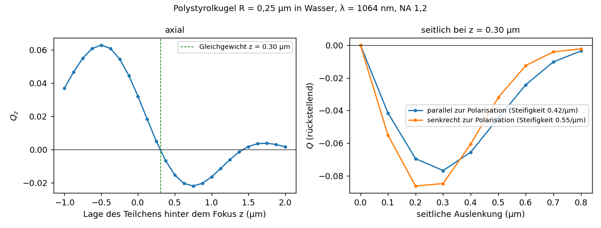

# Ergebnisse: Strahlanregung, Kräfte bei Dipolanregung, optische Pinzette (v0.37)

## Allgemeine einfallende Felder

`IncidentField` (`include/cbem/sources/incident_field.hpp`) liefert E und H an jedem Punkt; Nahfeld und Kräfte arbeiten mit jeder
Umsetzung (`exterior_near_field(…, b, …, inc, …)`, `make_near_field_eval`, `force_on_sphere/force_on_offset/fields_with_gradients`
mit Feldauswerter). Umsetzungen:

- **ebene Welle** (`PlaneWaveField`, auch chiral), **Nullfeld** (`ZeroField`: das Nahfeld liefert das reine Streufeld),
  **Dipol** (`DipoleField`, elektrisch und magnetisch),
- **Strahl als Winkelspektrum ebener Wellen** (`BeamField`). Jede Überlagerung ist eine exakte Lösung der Maxwell-Gleichungen,
  ohne paraxiale Näherung: E(r) = ∫ a(k̂) e^{ik k̂·(r − r_f)} dΩ, H = √(ε/μ) k̂ × E je Teilwelle.
  - fokussiert nach Richards–Wolf: a = f(θ) √cos θ [(E_ein·φ̂) φ̂ + (E_ein·ρ̂) θ̂] für θ ≤ arcsin(NA/n), Pupillenausleuchtung
    f(θ) = exp(−sin²θ/(f₀² sin²θ_max)),
  - Gaußstrahl: a = exp(−(k w₀ sin θ/2)²) (p_x cos θ, p_y cos θ, −sin θ (p_x cos φ + p_y sin φ)), exakt aus dem Querfeld
    exp(−ρ²/w₀²) p im Brennpunkt, jede Teilwelle transversal.
  - Normierung auf die Leistung 1 nach Parseval, P = ½√(ε/μ)(2π/k)² ∫|a|² dΩ. Kraft-Effizienz der Pinzette Q = F c/(n P).

| Prüfung | Ergebnis |
|---|---|
| Maxwell-Gleichungen (zentrale Differenzen) | \|∇·E\|/(k\|E\|) ≈ 10⁻⁸, \|∇×E − iωμH\|/(ω\|E\|) ≈ 10⁻⁷ |
| Poynting-Fluss gegen Parseval, Gaußstrahl w₀ = 2λ | 1,000000 in Brennebene und 3λ dahinter |
| dto. fokussiert NA 1,2, 80 × 160 Teilwellen, Fenster ±16λ | 1,0007 (f₀ = 1), 1,0000 (f₀ = 0,5) |
| Halbwertsbreite Gaußstrahl | 2,36λ (Soll w₀√(2 ln 2) = 2,355λ) |
| Brennfleck NA 1,2 in Wasser, x-polarisiert | 0,57λ₀ parallel, 0,45λ₀ senkrecht zur Polarisation (Depolarisation) |

Eine endliche Summe ebener Wellen wiederholt sich jenseits eines Radius, der umgekehrt proportional zur Winkelschrittweite ist
(Aliasing); mit 40 × 64 Teilwellen lag er bei NA 1,2 bei etwa 8,5λ. Für Teilchen nahe dem Fokus ist das unerheblich;
Voreinstellung 40 × 80.

## Kräfte bei Dipolanregung

Kraft auf einen Körper: Spannungstensor auf seiner Parallelfläche, angeregt vom Dipolfeld. Kraft auf den Emitter
(`emitter_force`): nur das Streufeld, das Eigenfeld ist am Ort singulär, F = ½ Re[Σ p_j ∇E_s,j* + Σ m_j ∇H_s,j*]
− (ωk³/12π) Re(p × m*). Abgestrahlter Impuls (`radiated_momentum`): Π = ∫ ½ε|E∞|² x̂ dΩ, freier Dipol plus Streufeld.
**Impulserhaltung** F_Körper + F_Emitter + Π = 0 (Goldkugel ε = −11 + 1,2i in Wasser, ωa = 0,5, Dipol bei r₀ = 1,5, n = 8 verdichtet):

| Dipol | Kraft auf die Kugel | auf den Emitter | abgestrahlter Impuls | Summe |
|---|---:|---:|---:|---:|
| radial | +0,2051 | −0,2029 | −0,0021 | +4·10⁻⁵ (2·10⁻⁴ relativ) |
| tangential | +0,0621 | −0,0622 | +0,0001 | −3·10⁻⁵ (5·10⁻⁴ relativ) |

Kugel und Emitter ziehen sich an (Wechselwirkung mit dem Spiegelbild); der Rückstoß der Abstrahlung ist klein, aber für die
Bilanz nötig.

## Optische Pinzette

`tweezers` (`apps/tweezers.cpp`): Das Teilchen bleibt fest, der Brennpunkt wandert; der Operator wird einmal aufgebaut, jede
Brennpunktlage ist eine neue rechte Seite (etwa 7 s bei 1 280 Dreiecken). Kraft über den Spannungstensor auf einer Kugel um das
Teilchen.

**Prüfungen:** Kleines Teilchen (Polystyrol R = 0,02 µm, kR = 0,16) im Fokus, drei Lagen auch seitlich versetzt, gegen die
unabhängige Dipolnäherung im Strahlfeld (Polarisierbarkeiten aus den Mie-Dipolkoeffizienten): 1,7–2,2 % bei n = 6, 0,6–0,8 % bei
n = 10 (unter dem Fehler der Dipolnäherung, etwa (kR)²). Großes Teilchen (R = 0,25 µm) n = 8 gegen n = 12: 0,2–1,0 %.

**Polystyrolkugel R = 0,25 µm in Wasser, λ = 1064 nm, NA 1,2, f₀ = 1, x-polarisiert** (n = 8;
`results/tweezers_ps250_*.csv`):

| Größe | Wert |
|---|---|
| stabile Gleichgewichtslage | 0,30 µm hinter dem Fokus (Q_z = −8·10⁻⁵) |
| axiale Steifigkeit | 0,093 je µm |
| größte axiale Kraft zum Fokus / rückstellend | +0,063 (0,5 µm davor) / −0,022 (0,75 µm dahinter) |
| instabile Lage | etwa 1,44 µm hinter dem Fokus |
| seitliche Steifigkeit parallel / senkrecht zur Polarisation | 0,42 / 0,55 je µm |
| größte seitliche Rückstellkraft parallel / senkrecht | −0,077 bei 0,3 µm / −0,086 bei 0,2 µm |

- Die Gleichgewichtslage liegt hinter dem Fokus, weil der Strahlungsdruck das Teilchen in Ausbreitungsrichtung schiebt; jenseits
  der instabilen Lage überwiegt er, und das Teilchen entkommt.
- Seitlich ist die Falle 4,5- bis 6-mal steifer als axial, typisch für optische Pinzetten; senkrecht zur Polarisation steifer,
  passend zum dort schmaleren Brennfleck.
- Ein Vergleich mit der verallgemeinerten Lorenz-Mie-Theorie für fokussierte Strahlen steht aus (nicht implementiert); die
  Größenordnung der Effizienzen ist für solche Teilchen plausibel.

## Grenzen

- Strahlen und Dipolquellen nur im achiralen Medium; Strahlachse +z.
- Die Kraft aus der Fernfeldbilanz (`force_from_far_field`) nur für ebene Wellen.
