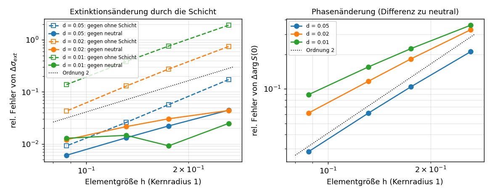
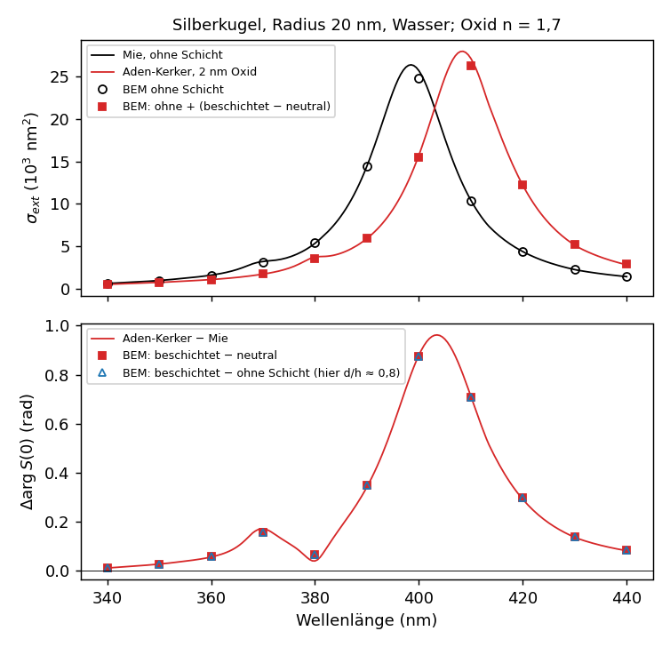
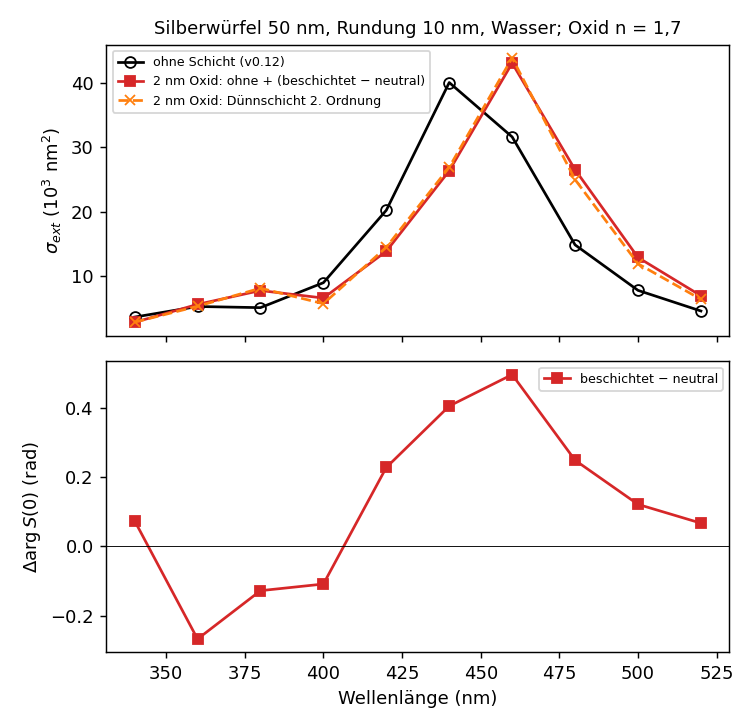
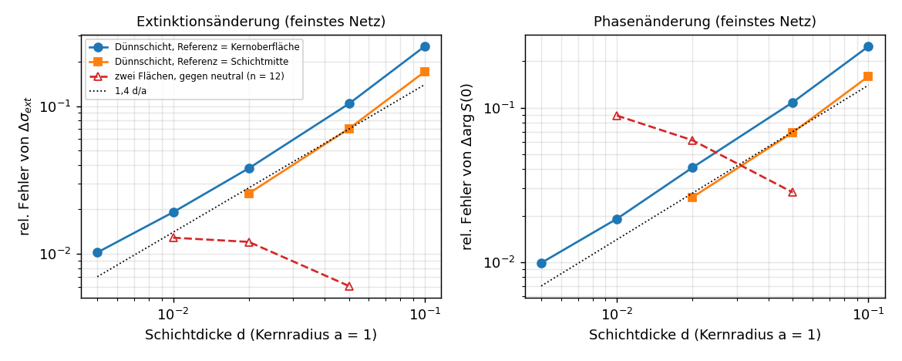
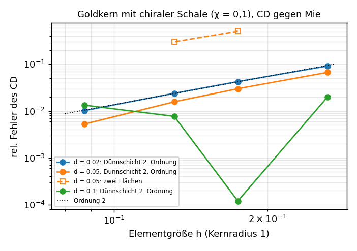
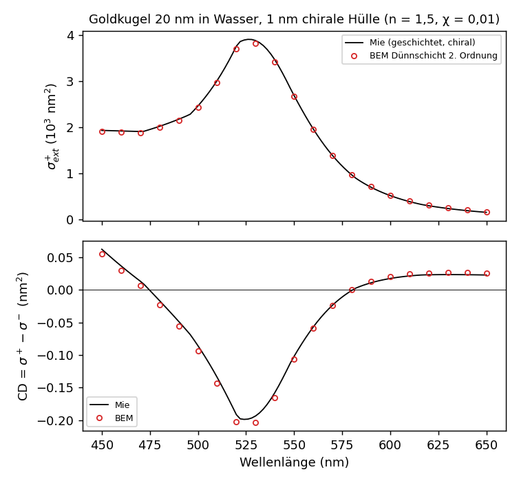

# Ergebnisse: beschichtete Grenzflächen (dünne Schichten, Kern-Schale, Dünnschicht-Näherung 1. und 2. Ordnung, chirale Schichten)

An Materialgrenzen liegen meist dünne Schichten (Oxide, Sulfide, Hüllen von wenigen nm), die Amplitude und Phase
des gestreuten Lichts verändern. Seit v0.13 behandelt der Kern verschachtelte Gebiete exakt: jede Schichtgrenze ist
eine eigene Fläche, jedes Gebiet hat seinen eigenen Cauchy-Operator (`LayeredScatteringProblem`, Theorie: AP 1,
Nachtrag „Verschachtelte Gebiete“). Seit v0.14 gibt es zusätzlich eine Dünnschicht-Näherung auf einer Fläche
(`ThinLayerScatteringProblem`), seit v0.15 in zweiter Ordnung einschließlich Krümmung, seit v0.16 mit punktweise konsistenten
zweiten Ableitungen und für mehrere Körper (Abschnitte „Dünnschicht-Näherung“).

## Formulierung

Geometrie als Grenzflächengraph: geschlossene, nach außen orientierte Flächen Γ_s, jede zwischen einem Innengebiet
in(s) und einem Außengebiet out(s); Gebiet 0 ist der Außenraum. Unbekannt ist je Fläche die Außenspur h_s, die
Innenspur ist J_s h_s. Jedes Gebiet R liefert auf seinem Rand die Cauchy-Bedingung u − E_R(σu) = 0 (σ = +1, wenn R
innen an der Fläche liegt, sonst −1), und Zeile s des Systems ist die halbe Summe der Bedingungen beider
Nachbargebiete:

    ½ (h_s − [E_out(σu)]_s) + ½ (J_s h_s − [E_in(σu)]_s) = h_inc,s      (h_inc nur an Flächen zum Außenraum)

Für einen homogenen Körper ist das genau T₁ = E₂⁺ + E₁⁻ J. Kern-Schale-Teilchen, Mehrfachschichten, mehrere
beschichtete Körper, Einschlüsse und chirale Schichten sind derselbe Code. Die lokale Struktur an jeder Fläche ist
die von T₁; die punktweise Vorkonditionierung 2(1 + J_s)⁻¹ bleibt. Fredholm-Eigenschaft und Konsistenz sind für glatte,
getrennte Flächen bewiesen, die Eindeutigkeit ist eine (numerisch gestützte) Vermutung.

Schichtflächen erzeugt `offset_surface(m, d)`: Knotenversatz mit n_f · δ = d für alle angrenzenden Flächennormalen
(kleinste Quadrate, Pseudoinverse), also auf glatten Stücken δ = d n, an Kanten und Ecken auf Gehrung. Ein Würfel
wird zum Würfel mit Kante 2 + 2d (exakt), eine Ikosaederkugel zur Kugel mit Radius 1 + d (Fehler 4·10⁻⁴ bei n = 6),
ein abgerundeter Würfel (ρ = 0,4) mit d = 0,08 behält seine flachen Seiten exakt bei 1,08; die Volumenzunahme weicht
wegen des Polyederfehlers um 0,8 % vom exakten Wert ab. Umklappende Dreiecke und Umstülpen (Versatz durch das
Innere) werden erkannt; seit v0.18 auch Faltung und Durchdringung ohne lokale Auffälligkeit: Knoten und Schwerpunkte der
Parallelfläche müssen von der Originalfläche mindestens 0,8 |d| entfernt sein (gültig: etwa |d|, auf Gehrung genau |d|).
Das erkennt etwa zwei Flächenteile mit einem Spalt enger als 2 |d| (zwei Kugeln mit Spalt 0,1: Versatz 0,06 abgelehnt,
0,03 angenommen); Gittersuche, linearer Aufwand.

```cpp
LayeredGeometry g(Medium{1.33 * 1.33});                           // Außenraum Wasser
add_coated_body(g, mesh, Medium{eps_ag}, {Coating{0.08, Medium{2.89}}});   // Schicht wächst nach außen
// add_coated_body(..., /*outward=*/false): Schicht innerhalb der Netzfläche (Oxidation verbraucht Metall)
LayeredScatteringProblem P(g, omega);
auto r = P.solve_plane_wave(d, p);                                  // r.sigma_ext, r.forward = S(0)
```

Neu ausgegeben wird die Vorwärtsamplitude S(0) = −ik p̄·E_∞(d)/|p|² in der Normierung von Bohren–Huffman
(σ_ext = 4π/k² Re S(0); Kugel: S(0) = Σ (2n+1)/2 (a_n + b_n)). arg S(0) ist die Phase des vorwärts gestreuten Lichts
relativ zur einfallenden Welle; sie bestimmt z. B. den effektiven Brechungsindex einer Teilchensuspension.

Referenz: `tools/mie_coated.py` (Aden–Kerker, beliebig viele Schichten über Riccati-Bessel-Transfer). Geprüft:
Schale = Außenmedium ergibt die Kernkugel, Schale = Kernmaterial die größere Kugel (beides auf 10⁻¹⁵),
quasistatische Polarisierbarkeit der beschichteten Kugel mit Fehler ∝ ω².

## Validierung: dicke Schale

Goldkern (ε = −11 + 1,2i, Radius 1) mit Glasschale (ε = 2,25) bis Radius 1,2, ωa = 0,5, konzentrische
Ikosaedernetze gleicher Feinheit n, H-Toleranz 10⁻⁶, GMRES 10⁻⁸.

| n | Dreiecke | Q_ext | S(0) | GMRES |
|---:|---:|---:|---|---:|
| 3 | 360 | 0,98207 | 0,08839 − 0,27516i | 45 |
| 4 | 640 | 0,97305 | 0,08757 − 0,28631i | 48 |
| 6 | 1 440 | 0,96563 | 0,08691 − 0,29468i | 40 |
| 8 | 2 560 | 0,96301 | 0,08667 − 0,29770i | 40 |
| Aden–Kerker | | 0,95996 | 0,08640 − 0,30163i | |

Q_ext und die komplexe Amplitude (also auch ihre Phase) konvergieren mit Ordnung 2 (Fehler von Q: 1,31·10⁻²,
5,67·10⁻³, 3,05·10⁻³ für n = 4, 6, 8). Ohne Schicht reproduziert `LayeredScatteringProblem` `ScatteringProblem`
bitgenau (ein und zwei Körper, `test_layered`). Eine chirale Schale erfüllt σ_s(χ) = σ_{−s}(−χ) auf 6·10⁻⁸.

## Dünne Schichten: Differenz zur neutralen Rechnung

Oxidschichten sind dünner als die Elemente (d ≪ h). Dann trägt die Rechnung einen systematischen Fehler von der
Größe des Diskretisierungsfehlers: Für d → 0 entartet das diskrete System zu den einzelnen Projektorbedingungen
E₂⁺h = h_inc und E₁⁻Jh = 0, deren Konsistenzfehler (diskret ist E² ≠ 1) die Lösung verschiebt (AP 1, Nachtrag).
Deutlich wird das an einer **neutralen Schale** aus Außenmedium, die physikalisch nichts ändert:

| n = 4 (h ≈ 0,26) | d = 0,05 | d = 0,02 | d = 0,01 |
|---|---:|---:|---:|
| σ ohne Schicht | 1,98902 | 1,98902 | 1,98902 |
| σ neutrale Schale | 1,92729 | 1,86028 | 1,81434 |

Der Fehler hängt aber kaum vom Schichtmaterial ab und hebt sich in der Differenz zur neutralen Rechnung auf
denselben Netzen heraus. Die Wirkung der Schicht ist deshalb als

    Δ = (beschichtet) − (neutral, gleiche Netze)

zu bestimmen, nicht als Differenz zur Rechnung ohne Schicht. Goldkern, Glasschale, ωa = 0,5
(`results/coated_thin.csv`, `tools/analyze_coated.py`); relativer Fehler von Δσ_ext bzw. Δ arg S(0) gegen
Aden–Kerker:

| d | n | d/h | Δσ gegen ohne Schicht | Δσ gegen neutral | Δ arg S gegen neutral |
|---:|---:|---:|---:|---:|---:|
| 0,05 | 4 | 0,19 | −17 % | −4,5 % | −21 % |
| | 6 | 0,29 | −5,7 % | −2,2 % | −10 % |
| | 8 | 0,38 | −2,6 % | −1,3 % | −6,1 % |
| | 12 | 0,57 | −0,9 % | −0,6 % | −2,8 % |
| 0,02 | 4 | 0,08 | −75 % | −4,4 % | −33 % |
| | 8 | 0,15 | −13 % | −2,2 % | −12 % |
| | 12 | 0,23 | −4,3 % | −1,2 % | −6,2 % |
| 0,01 | 4 | 0,04 | −192 % | +2,5 % | −36 % |
| | 8 | 0,08 | −38 % | −1,5 % | −16 % |
| | 12 | 0,11 | −14 % | −1,3 % | −8,9 % |

(Exakt: Δσ = 0,483, 0,183, 0,090; Δ arg S = 0,0209, 0,0082, 0,0041 rad.)



- **Extinktion:** Gegen die neutrale Rechnung ist Δσ schon bei d/h ≈ 0,04 auf wenige Prozent genau, unabhängig von
  d/h. Die Differenz zur Rechnung ohne Schicht hat dort sogar das falsche Vorzeichen und wird erst für h ≲ 2d
  brauchbar.
- **Phase:** Die Phasenänderung ist die empfindlichere Größe. Gegen neutral konvergiert sie für d = 0,05 mit Ordnung
  etwa 2, für d = 0,01 langsamer (Ordnung etwa 1,3); auf dem feinsten Netz 3–9 %.
- **Arbeitsweise:** Absolutwert aus einer konvergierten Rechnung ohne Schicht (günstig, eine Fläche; auch mit HODLR
  oder Blockvorkonditionierung) plus Schichtwirkung aus beschichteter und neutraler Rechnung auf gröberen Netzen:
  σ ≈ σ₀ + (σ_beschichtet − σ_neutral), ebenso für arg S. `scatter_coated --neutral`, in `spectrum` über eine
  zweite Rechnung mit dem Außenmedium als Schichtmaterial.
- **Iterationen:** 42–44 beschichtet, 37–38 neutral, 36 ohne Schicht (punktweise Vorkonditionierung); kein Anstieg für
  dünne Schichten.

## Nahfeld paralleler Flächen

Liegen zwei Flächen im Abstand d ≪ h, sind die Paare über die Schicht hinweg nahe Paare mit analytischem
Innenintegral und adaptiver Außenregel. Die Außenregel verfeinerte bisher, bis jedes Teilstück klein gegen seinen
Abstand zum inneren Dreieck ist, also flächig auf die Größe d, mit (h/d)² Teilstücken. Liegt das Teilstück ganz auf
einer Seite der Ebene des inneren Dreiecks, sind die Innenintegrale (Φ₀ und 1/r) dort aber reell-analytisch mit
Singularitäten nur auf dem Rand des inneren Dreiecks; dann genügt der Abstand zum Rand
(`EntryParams::adapt_to_boundary`, Voreinstellung für geschichtete Körper: `layered_entry_params()`). Verfeinert
wird nur noch in einem Band der Breite d um die projizierten Kanten.

Zwei parallele Dreiecke (h ≈ 1) im Abstand d, Fehler gegen eine Referenz mit feinem Restglied (`k = 2 + 0,1i`):

| d | bisher | mit Randabstand |
|---:|---|---|
| 0,1 | 2,0·10⁻⁴ | 2,0·10⁻⁴ |
| 0,03 | 1,3·10⁻⁴ | 1,3·10⁻⁴ |
| 0,01 | 1,2·10⁻⁴ | 1,5·10⁻⁴ |

Der verbleibende Fehler kommt in beiden Fällen von der 7-Punkt-Regel für das glatte Restglied; die Rechenzeit sinkt
je Paar um den Faktor 3–4 (d = 0,01: 0,069 s → 0,019 s). Im Gesamtproblem ist der Gewinn kleiner, weil die meisten
Nahpaare keine eng benachbarten Paare über die Schicht hinweg sind (Goldkern mit Glasschale, n = 8, 2 560 Dreiecke,
`results/coated_nearrule.csv`):

| d | Nahfeld bisher | mit Randabstand | Ergebnis |
|---:|---:|---:|---|
| 0,05 (d/h = 0,38) | 5,9 s | 6,1 s | identisch auf 6 Stellen |
| 0,01 (d/h = 0,08) | 18,4 s | 14,9 s | identisch auf 6 Stellen |

Die Nahfeldzeit wächst mit abnehmendem d (d = 0,05 → 0,01: etwa Faktor 2,5); gegen die Gesamtzeit (Aufbau der
H-Matrizen, GMRES) bleibt sie aber untergeordnet. Für bestehende Rechnungen mit einer Fläche bleibt die
Voreinstellung unverändert (`adapt_to_boundary = false`).

Parallelflächen statt konzentrischer Kugeln (`scatter_coated --offset`, d = 0,05, n = 8): Q_ext = 0,681306 statt
0,680712 (0,09 %), entsprechend dem Radiusfehler der Parallelfläche von 4·10⁻⁴.

## Anwendung: Silberteilchen mit 2 nm Oxidschicht

### Silberkugel, Radius 20 nm, in Wasser

Silber nach Johnson–Christy, Hintergrund n = 1,33, Schicht 2 nm mit n = 1,7 (Modellwert für eine dünne Oxid-/
Sulfidschicht; eigene Daten über `--coating "2:Datei.yml"`), nach außen gewachsen. `spectrum --sphere 8` (1 280
Dreiecke je Fläche, h ≈ 2,6 nm, d/h ≈ 0,8), H-Toleranz 10⁻⁴; neutral mit Wasser als Schichtmaterial. Referenz:
Aden–Kerker mit denselben interpolierten Daten (`results/agsphere20_*.csv`, `tools/plot_coated.py`).



| λ (nm) | σ Mie ohne | σ Aden–Kerker | σ BEM korrigiert | Δσ exakt | Δσ BEM | Δ arg S exakt | Δ arg S BEM |
|---:|---:|---:|---:|---:|---:|---:|---:|
| 360 | 1 617 | 1 096 | 1 100 | −520 | −524 | 0,056 | 0,058 |
| 370 | 3 228 | 1 739 | 1 751 | −1 489 | −1 400 | 0,172 | 0,157 |
| 380 | 5 364 | 3 747 | 3 591 | −1 617 | −1 835 | 0,040 | 0,068 |
| 390 | 14 458 | 5 928 | 5 961 | −8 530 | −8 471 | 0,342 | 0,350 |
| 400 | 25 689 | 15 740 | 15 528 | −9 949 | −9 251 | 0,880 | 0,875 |
| 410 | 10 442 | 27 135 | 26 309 | +16 693 | +15 991 | 0,712 | 0,709 |
| 420 | 4 390 | 12 203 | 12 197 | +7 813 | +7 776 | 0,292 | 0,297 |
| 430 | 2 272 | 5 145 | 5 232 | +2 873 | +2 916 | 0,137 | 0,140 |

(σ in nm², Phase in rad; „korrigiert“ = BEM ohne Schicht + (beschichtet − neutral).)

- Die 2-nm-Schicht verschiebt die Dipolresonanz um etwa 10 nm nach Rot (Maximum von knapp 400 auf etwa 408 nm) und
  hebt sie leicht an; die Phase des vorwärts gestreuten Lichts ändert sich um bis zu 0,9 rad (bei 400 nm). Die
  Phasenänderung ist auf der kurzwelligen Flanke der Resonanz am größten, weil dort die Resonanz über die
  Wellenlänge „hinwegwandert“.
- Die BEM trifft die Phasenänderung an der Resonanz auf 0,5 % (400, 410 nm) bis 2 % (390, 420 nm) und Δσ auf 1–7 %.
  Im Bereich des Quadrupols (370–380 nm) sind die Abweichungen größer (Δσ 6–13 %, Phase 0,015–0,028 rad absolut):
  höhere Multipole brauchen feinere Netze.
- Hier ist d/h ≈ 0,8; die Differenz zur Rechnung ohne Schicht stimmt deshalb mit der zur neutralen Rechnung auf
  10⁻³ überein. Bei gröberen Netzen oder dünneren Schichten gilt das nicht mehr (siehe oben).
- Kosten je Wellenlänge (ein Kern): ohne Schicht 11 s, mit Schicht 30 s (2 560 Dreiecke, 22–61 Iterationen).

### Silberwürfel, Kante 50 nm, Rundungsradius 10 nm, in Wasser

Derselbe Würfel wie in `results_roundcube.md` (Gmsh, ρ = 0,4 Einheiten, c = 12, 1 208 Dreiecke, Einheit 25 nm),
2 nm Oxid (n = 1,7) nach außen über `offset_surface` (auf den flachen Seiten h ≈ 7,5 nm, an den Rundungen ≈ 5 nm,
d/h ≈ 0,3–0,4). `spectrum --coating`, H-Toleranz 10⁻³; ohne Schicht die Werte aus v0.12
(`results/agcube_rho0.4.csv`), Schichtwirkung als Differenz zur neutralen Rechnung
(`results/agcube_rho0.4_ox2*.csv`). Eine Referenz gibt es hier nicht.



| λ (nm) | 340 | 360 | 380 | 400 | 420 | 440 | 460 | 480 | 500 | 520 |
|---|---:|---:|---:|---:|---:|---:|---:|---:|---:|---:|
| σ ohne Schicht | 3 704 | 5 343 | 5 165 | 9 028 | 20 254 | **40 030** | 31 609 | 14 889 | 7 842 | 4 646 |
| σ mit 2 nm Oxid | 2 895 | 5 674 | 7 815 | 6 650 | 13 900 | 26 360 | **43 039** | 26 535 | 12 940 | 7 007 |
| Δ arg S(0) (rad) | +0,07 | −0,27 | −0,13 | −0,11 | +0,23 | +0,40 | **+0,50** | +0,25 | +0,12 | +0,07 |

- Die Hauptresonanz verschiebt sich um etwa 20 nm nach Rot (Maximum von etwa 440 auf etwa 460 nm, Raster 20 nm),
  doppelt so stark wie bei der Kugel mit derselben Schicht: Das Feld ist an Kanten und Ecken konzentriert, wo die
  Schicht den größten Anteil des Nahfelds füllt. Die Nebenstruktur bei 380 nm wird stärker.
- Die Phase des vorwärts gestreuten Lichts ändert sich um bis zu 0,5 rad; unterhalb von 410 nm wechselt das Vorzeichen.
  Die Verschiebung ist so groß wie die zwischen den Rundungsradien 10 und 7,5 nm (`results_roundcube.md`): Schicht
  und Kantenform sind bei Nanowürfeln gleich wichtige Parameter und aus der Streuung allein kaum zu trennen.
- Die neutrale Rechnung weicht hier nur um 0,5–3,5 % von der Rechnung ohne Schicht ab (d/h ≈ 0,3); die Korrektur
  ist klein gegen die Schichtwirkung, aber an der Resonanzflanke nicht vernachlässigbar.
- Kosten je Wellenlänge: 26–80 s mit Schicht (2 416 Dreiecke, 56–115 Iterationen), ohne Schicht 8–12 s.


## Dünnschicht-Näherung erster Ordnung (eine Fläche)

Idee: eine Greensche Funktion, die die Schichtfolge enthält. Exakt gibt es sie nur für ebene Schichtungen
(Sommerfeld-Integrale); für eine dünne Schicht genügt die lokal ebene Näherung, Krümmung geht erst in O(d²) ein. In
erster Ordnung in d ist die Wirkung der Schicht ein Sprung der Felder an der Referenzfläche Γ (X = verdrängtes
Medium):

    [E_t] = d ( ∇_Γ(D_n (1/ε_c − 1/ε_X)) − iω (μ_c − μ_X) n × H_t ),   [D_n] = −d (ε_c − ε_X) ∇_Γ·E_t
    [H_t] = d ( ∇_Γ(B_n (1/μ_c − 1/μ_X)) + iω (ε_c − ε_X) n × E_t ),   [B_n] = −d (μ_c − μ_X) ∇_Γ·H_t

In Dirac-Form ist das der Term erster Ordnung des Transfers exp(d n(ik_c − ∇_Γ)) über die Schicht. Die Innenspur wird
J_eff h = J h + L_d h, und T_eff = E₂⁺ + E₁⁻ J_eff lebt auf **einer** Fläche (`ThinLayerScatteringProblem`). E₁(L_d h)
ist das Cauchy-Integral der Schicht-Greenschen Funktion erster Ordnung, nach partieller Integration der Ableitungen
vom Kern auf die Dichte.

Diese Reihenfolge ist wesentlich: Als Kern angewandt wäre die Schichtkorrektur hypersingulär (∼ d/ρ³). Auf stückweise
konstanten Dichten ergäbe das an jeder Elementkante Beiträge ∼ d log(h/d), also einen inkonsistenten Operator. Auf der
Dichte genügen dagegen lokale Flächenableitungen über die drei Kantennachbarn (`SurfaceFV`), und alle H-Matrizen
bleiben die der unbeschichteten Rechnung:

- **Gradient:** Kleinste-Quadrate-Fit in der Tangentialebene (exakt für lineare Funktionen). Der naheliegende
  Green-Gauß-Gradient mit Kantenmitteln ist auf Ikosaedernetzen inkonsistent: Sein maximaler Fehler bleibt bei
  0,18 → 0,15 → 0,14 → 0,13 (n = 6 … 48) stehen, der Kleinste-Quadrate-Gradient fällt mit Ordnung 1
  (0,023 → 0,011 → 0,006 → 0,003).
- **Divergenz:** Flussform mit Kantenmitteln; konservativ (keine Nettoladung der Schicht), Ordnung 1
  (max. Fehler 0,12 → 0,066 → 0,034 → 0,017 für div_Γ der tangentialen Projektion eines konstanten Feldes).

Die Lage der Referenzfläche ist wählbar (Anteil f der Schicht innerhalb, `--thin-ref f`); beide Anteile addieren sich in
erster Ordnung. Nutzung:

```bash
scatter_coated --n 8 --omega 0.5 --core -11,1.2 --coat 0.01,2.25,0 --thin-ref 0.5 --bare     # Kugel, Wirkung = Differenz zu bare
spectrum --sphere 8 --unit 20 --materials Ag --nbg 1.33 --coating "2:2.89,0" --thin 0.5 ...
```

### Genauigkeit

Goldkern, Glasschale, ωa = 0,5 (`results/thin_layer.csv`, `tools/analyze_thin.py`); Schichtwirkung als Differenz zur
Rechnung ohne Schicht auf demselben Netz (keine neutrale Rechnung nötig), relative Fehler gegen Aden–Kerker, Δσ / Δ arg S:

| d | n = 4 | n = 8 | n = 16 | Referenz Mitte, n = 12 | zwei Flächen, n = 12 |
|---:|---:|---:|---:|---:|---:|
| 0,005 | +4,0 / +4,4 % | +1,6 / +2,0 % | +1,0 / +1,0 % | – | – |
| 0,01 | +4,9 / +5,3 % | +2,5 / +2,6 % | +1,9 / +1,9 % | – | −1,3 / −8,9 % |
| 0,02 | +6,8 / +7,5 % | +4,4 / +4,7 % | +3,8 / +4,1 % | +2,6 / +2,6 % | −1,2 / −6,2 % |
| 0,05 | +13,3 / +14,5 % | +10,9 / +11,5 % | +10,4 / +10,8 % | +7,0 / +6,9 % | −0,6 / −2,8 % |
| 0,1 | +28,0 / +28,8 % | +25,8 / +25,6 % | – | +17,1 / +16,0 % | – |

(Referenzfläche an der Kernoberfläche, außer „Referenz Mitte“; exakt: Δσ = 0,0446, 0,0900, 0,1833, 0,4830, 1,0535.)



- **Diskretisierung:** Der Diskretisierungsfehler ist klein und fällt mit dem Netz; bei n = 8 liegt er unter 1 %,
  mit Referenz in der Schichtmitte ist die Rechnung schon bei n = 4–6 konvergiert. Die Iterationen bleiben für d < h bei
  35–60 (wie ohne Schicht) und steigen für d ≳ h (d = 0,1, n = 12: 150), weil die Norm von L_d wie d/h wächst.
- **Modellfehler:** Übrig bleibt der Abbruchfehler erster Ordnung, etwa 2 d/a relativ zur Schichtwirkung
  (Referenz an der Kernoberfläche) bzw. 1,3–1,7 d/a (Schichtmitte). Die Rechnung ist dabei nicht streng linear in d
  (das System wird selbstkonsistent gelöst) und liegt näher an der exakten als an der linearisierten Lösung.
- **Vergleich:** Für die Extinktionsänderung ist die exakte Zwei-Flächen-Rechnung mit neutraler Referenz auf feinen
  Netzen genauer. Für die Phasenänderung ist die Näherung unterhalb von d/a ≈ 0,03 genauer (d = 0,01: 1,9 % gegen
  8,9 %), und sie kostet etwa ein Fünftel (n = 12: rund 50 s gegen rund 300 s für beschichtete und neutrale Rechnung).
- **Kontrollen** (n = 8, d = 0,02): Schicht aus Kernmaterial (entspricht der größeren Kugel) −1,6 / −1,8 %, Schicht
  nach innen (verdrängt Gold) +2,7 / −0,3 %, verlustbehaftete Schicht (ε = 4 + i) +4,9 / +5,6 %.

### Silberkugel mit 2 nm Oxid (d/a = 0,1)

Derselbe Fall wie oben mit `spectrum --thin 0.5` (`results/agsphere20_ox2_thin.csv`, grüne Rauten in der Abbildung der
Silberkugel). Das Maximum bei 410 nm trifft Aden–Kerker (27 116 gegen 27 135 nm²), an den Flanken überschätzt die
Näherung die Verschiebung (400 nm: 13 453 gegen 15 740; 420 nm: 14 229 gegen 12 203), die Phasenänderung liegt an der
Resonanz 8–20 % zu hoch. Das entspricht dem Modellfehler bei d/a = 0,1. Für diesen Fall ist die Zwei-Flächen-Rechnung
(0,5–2 % in der Phase) die richtige Wahl.

## Dünnschicht-Näherung zweiter Ordnung (Dirac-Form, v0.15)

Auf Parallelflächen im Abstand ν bleibt die Normale entlang der Normalenlinien konstant, und der Dirac-Operator zerfällt
in ∇ = n∂_ν + D^(ν) mit D^(ν) = D − νD_S + O(ν²). D = Σ e_i ∂_i ist der tangentiale Dirac-Operator, D_S = Σ κ_i e_i ∂_i
der mit dem Formoperator S = ∇_Γ n gewichtete. Aus (∇ − ik)F = 0 folgt ∂_ν F = B(ν)F mit B = n(ik − D^(ν)) und
B′ = n D_S; ein Schritt s ab ν₀ in einem homogenen Medium ist

    U = 1 + s B + (s ν₀ + s²/2) B′ + s²/2 B² + O(s³).

J_eff ist das Produkt aus Schritten und Transmissionsabbildungen von der Außenspur (Medium 2 bei ν = 0) durch alle
Schichten bis in Medium 1 und zurück zu ν = 0 (`ThinLayerModel::Dirac2`, jetzt Voreinstellung; `Dirac1` ist die erste
Ordnung derselben Form). Mehrfachschichten sind weitere Faktoren. Die Krümmung geht über D_S und über die
Ortsabhängigkeit von J(n) ein; der Fehler ist O(d³), relativ zur Schichtwirkung O((d/a)²).

### Diskretisierung

- **D und B²:** D aus den Kleinste-Quadrate-Gradienten aller acht Komponenten, B² durch zweimalige Anwendung.
  Zusammengesetzte zweite Ableitungen sind nur im L²-Mittel konsistent (Laplace–Beltrami von Y₂: 2,6 % → 0,5 % für
  n = 6 … 48, punktweise an den singulären Ikosaederecken etwa 7 %). Da B² nur eine Korrektur der relativen Größe d/a ist,
  genügt das.
- **Normalen:** Die Facettennormale eines ebenen Dreiecks weicht um O(h) von der glatten Normalen am Schwerpunkt ab;
  abgeleitet über den Abstand h wird daraus ein Fehler O(1). Mit Facettennormalen hatte der Formoperator auf der Kugel
  einen nicht konvergierenden Fehler von 15 % von 1/R. Alle Schichtkorrekturen verwenden deshalb glatte Normalen ñ
  (Mittel der winkelgewichteten Knotennormalen). Damit fällt der Fehler von S mit Ordnung 1
  (0,018 → 0,0095 → 0,0052 für n = 6, 12, 24). Die Sprungform erster Ordnung nutzt sie ebenfalls; ihre Werte ändern sich
  dadurch um 0,03 % der Schichtwirkung.
- **T₁ ohne Schicht:** J_eff = J(n) + [Kette(ñ) − J(ñ)], sodass ohne Schicht exakt T₁ entsteht. Gleiche benachbarte
  Medien werden zusammengefasst, sodass eine neutrale Schicht exakt wirkungslos ist.

### Genauigkeit

Goldkern, Glasschale, ωa = 0,5, Referenzfläche an der Kernoberfläche (`results/thin_layer2.csv`,
`tools/analyze_thin.py`); relativer Fehler der Schichtwirkung Δσ / Δ arg S gegen Aden–Kerker:

| d/a | 1. Ordnung, n = 16 | 2. Ordnung, n = 8 | 2. Ordnung, n = 16 | zwei Flächen, n = 12 |
|---:|---:|---:|---:|---:|
| 0,005 | +1,0 / +1,0 % | +0,6 / +1,0 % | **+0,2 / 0,0 %** | – |
| 0,01 | +1,9 / +1,9 % | +0,6 / +0,7 % | **+0,1 / +0,2 %** | −1,3 / −8,9 % |
| 0,02 | +3,8 / +4,1 % | +0,4 / +0,7 % | **+0,1 / +0,1 %** | −1,2 / −6,2 % |
| 0,05 | +10,4 / +10,8 % | −0,4 / 0,0 % | **−0,7 / −0,5 %** | −0,6 / −2,8 % |
| 0,1 | +25,8 / +25,6 % (n = 8) | −3,5 / −2,3 % | −3,7 / −2,5 % (n = 12) | – |
| 0,2 | – | −19 / −13 % | – | – |


- Die zweite Ordnung senkt den Modellfehler um eine bis zwei Größenordnungen; der Rest wächst wie (d/a)² (von 0,05 auf
  0,1 etwa Faktor 5, von 0,1 auf 0,2 Faktor 5,4). Bis d/a = 0,05 ist sie der exakten Zwei-Flächen-Rechnung
  ebenbürtig (Extinktion) bzw. überlegen (Phase), bei etwa einem Fünftel der Kosten.
- **Kontrollen** (n = 8): Doppelschicht (3 % Oxid ε = 4 + i, darüber 3 % Glas) −0,7 / 0,0 %, verlustbehaftete Schicht
  (ε = 4 + i, d = 0,05) −0,5 / +0,2 %, Schicht aus Kernmaterial (Gold, d = 0,05) −1,9 / −2,8 %.
- **Referenz auf der Metallseite:** Größere Fehler treten auf, wenn die Kette durch ein Medium mit großem |ε|
  propagiert: Die Terme zweiter Ordnung enthalten Kontraste wie ε₂/ε₁ und werden grob um |ε_Metall/ε_Dielektrikum|
  verstärkt, der Abbruchfehler wie der Diskretisierungsfehler der zweiten Ableitungen. Beispiel Schicht nach innen
  (Glas ersetzt 5 % Gold, n = 12): Mit der Referenzfläche außen (Extrapolation im Gold) ist σ um 1,58 % zu groß, mit der
  Referenzfläche auf der Metallseite (`--thin 0`, Netz um d nach innen versetzt) um 0,71 %, genauso viel wie ohne Schicht
  (0,80 %); das Schichtmodell trägt dann praktisch nichts zum Fehler bei. Die Referenzfläche gehört deshalb auf die Seite
  des Mediums mit dem größten |ε|, bei Metallteilchen mit Oxid also auf die Metalloberfläche.
- **Stabilität:** Die Terme wachsen wie (d/h)², für d ≳ h steigen die Iterationen stark (d/h = 0,76: 95, 1,14: 241,
  1,52: 476; bei 2,3 kein Abschluss in vertretbarer Zeit). Für d ≳ h ist die exakte Formulierung zu verwenden.

### Silberkugel mit 2 nm Oxid (d/a = 0,1)

`spectrum --thin 0 --thin-model dirac2` (`results/agsphere20_ox2_thin2.csv`, orange Kreuze in der Abbildung der
Silberkugel), relativer Fehler der Phasenänderung gegen Aden–Kerker:

| λ (nm) | Δ arg S exakt | 1. Ordnung (Mitte) | 2. Ordnung | zwei Flächen |
|---:|---:|---:|---:|---:|
| 390 | 0,342 | +7,7 % | +1,6 % | +2,2 % |
| 400 | 0,880 | +8,2 % | −1,7 % | −0,5 % |
| 410 | 0,712 | +19,9 % | −3,1 % | −0,4 % |
| 420 | 0,292 | +26,4 % | −1,2 % | +1,7 % |
| 430 | 0,137 | +25,5 % | 0,0 % | +2,5 % |

σ bei 400 nm: 15 699 gegen 15 740 nm² (−0,3 %), bei 410 nm 25 951 gegen 27 135 (−4,4 %; zwei Flächen −3,0 %). Die
Abweichung bei 380 nm (Quadrupol) haben beide Verfahren gleichermaßen; sie stammt aus der Rechnung ohne Schicht auf diesem
Netz. Die zweite Ordnung erreicht hier also die Genauigkeit der exakten Rechnung, bei etwa halben Kosten (20–32 s je
Wellenlänge gegen etwa 30 s beschichtet plus 30–50 s neutral; die Iterationen steigen auf 42–86).

### Quadratische Anpassung der zweiten Ableitungen (v0.16)

`ThinLayerModel::Dirac2Fit` (jetzt Voreinstellung) bestimmt Gradient und Hesse-Matrix jeder Komponente mit einer
quadratischen Anpassung über alle Dreiecke mit gemeinsamem Knoten (etwa 12, Tangentialkoordinaten zur glatten Normalen)
und verwendet die geschlossene Form

    B²F = −k²F − DDF − 2H n(ikF − DF),     DDF = Σ_c [Δ_Γ F_c − (S ∇_Γ F_c) ∧ n] e_c

(aus D(nX) = 2H X − n DX und ∇_a∇_b φ = Hess_ab − n_b (S∇_Γφ)_a für die normal konstante Fortsetzung; H = tr S / 2).
Laplace–Beltrami von Y₂ auf der Kugel:

| n | zusammengesetzt L² / max | quadratische Anpassung L² / max |
|---:|---:|---:|
| 6 | 0,129 / 0,36 | 0,078 / 0,17 |
| 12 | 0,071 / 0,50 | 0,020 / 0,042 |
| 24 | 0,043 / 0,67 | 0,0054 / 0,016 |
| 48 | 0,029 / 0,75 | 0,0015 / 0,0086 |

Die Anpassung ist punktweise konsistent (L² etwa Ordnung 2, max. Ordnung 1,4); zusammengesetzt stagniert der
Maximalfehler an den singulären Ikosaederecken. Wirkung im Streuproblem (n = 8, Δσ / Δ arg S gegen Aden–Kerker):

| Fall | Dirac2 (zusammengesetzt) | Dirac2Fit |
|---|---:|---:|
| Vakuumschicht nach innen, d = 0,02 (Extrapolation im Gold) | −1,5 / −3,6 % | +0,2 / −0,6 % |
| Vakuumschicht nach innen, d = 0,05 | −2,4 / −5,3 % | 0,0 / −0,7 % |
| Schicht aus Kernmaterial (Gold), d = 0,05 | −1,9 / −2,8 % (88 It.) | −1,1 / −1,4 % (55 It.) |
| Glas außen, d = 0,02 | +0,4 / +0,7 % | −0,7 / −0,5 % |
| Glas außen, d = 0,05 | −0,4 / 0,0 % | −1,6 / −1,1 % |

Bei Metallpropagation hilft die Anpassung deutlich. Bei dielektrischen Schichten liegt sie auf groben Netzen etwa 1 %
tiefer, konvergiert aber gegen denselben Grenzwert (Glas, d = 0,02: −2,3 → −0,7 → −0,4 % für n = 4, 8, 12; zusammengesetzt
+1,8 → +0,4 → +0,2 %). Silberkugel mit 2 nm Oxid: beide Varianten gleichwertig (Phase an der Resonanz 1–4 %,
`results/agsphere20_ox2_thin2fit.csv`), die Anpassung braucht weniger Iterationen (58–63 statt 67–74). Wegen der
punktweisen Konsistenz und der Metallfälle ist Dirac2Fit die Voreinstellung.

### Mehrere Körper (v0.16)

`ThinLayerScatteringProblem(std::vector<ThinBody>, …)`: E₂ auf der Vereinigung aller Flächen, blockdiagonaler Innenoperator,
J_eff je Körper; `spectrum --thin` und `scatter_coated --mesh … --thin` verarbeiten Gmsh-Dateien mit mehreren Körpern.
Zwei Körper im Abstand 60 sind auf 0,1 % additiv. Dimer aus Goldkugeln mit Glasschale (d = 0,05, Spalt zwischen den
Schalen 0,3, Polarisation entlang der Achse): Die Kopplung verstärkt die Schichtwirkung auf das 6-Fache des Einzelkörpers.

| n | Δσ Dünnschicht | Δσ zwei Flächen (gegen neutral) | Δ arg S Dünnschicht | Δ arg S zwei Flächen |
|---:|---:|---:|---:|---:|
| 6 | 5,627 | 5,818 | 0,0972 | 0,0976 |
| 8 | 5,809 | 5,951 | 0,0989 | 0,0996 |
| extrapoliert (Ordnung 2) | ≈ 6,04 | ≈ 6,12 | ≈ 0,101 | ≈ 0,102 |

Beide Verfahren konvergieren aufeinander zu und stimmen extrapoliert auf gut 1 % überein.

### Silberwürfel mit Oxid (nicht kugelförmig)

Abgerundeter Silberwürfel (50 nm, Rundung 10 nm, Wasser), Referenzfläche auf der Metalloberfläche (`spectrum --thin 0`),
verglichen mit der exakten Zwei-Flächen-Rechnung (Differenz zur neutralen Rechnung) auf demselben Netz
(`results/agcube_rho0.4_ox*_thin.csv`, orange Kurve in der Abbildung des Silberwürfels). Schichtwirkung Δσ:

| λ (nm) | 2 nm: zwei Flächen | 2 nm: Dünnschicht | 1 nm: zwei Flächen | 1 nm: Dünnschicht |
|---:|---:|---:|---:|---:|
| 440 | −13 670 | −13 114 (−4,1 %) | −7 196 | −6 277 (−12,8 %) |
| 460 | +11 430 | +12 245 (+7,1 %) | +8 334 | +7 920 (−5,0 %) |
| 480 | +11 646 | +10 110 (−13,2 %) | +5 437 | +4 834 (−11,1 %) |
| 500 | +5 097 | +4 123 (−19,1 %) | +2 313 | +2 046 (−11,6 %) |

Der Unterschied hängt nicht von der Schichtdicke ab. Ein Modellfehler (∼ (d/ρ)² mit dem Rundungsradius ρ) würde bei halber
Dicke auf ein Viertel fallen; es ist also ein Diskretisierungsfehler. Netzverfeinerung bei 480 nm und 1 nm Oxid:

| Netz | Δσ Dünnschicht | Δσ zwei Flächen | Unterschied |
|---|---:|---:|---:|
| 1 208 Dreiecke (h = 0,3, 3 Elemente je Viertelrundung) | +4 834 | +5 437 | −11,1 % |
| 2 048 Dreiecke (h = 0,22, 4 Elemente je Viertelrundung) | +5 260 | +5 611 | −6,3 % |
| extrapoliert (Ordnung 2) | ≈ 5 755 | ≈ 5 813 | ≈ −1 % |

Beide konvergieren aufeinander zu; die Dünnschicht-Näherung ändert sich mit dem Netz aber dreimal so stark (+8,8 % gegen
+3,2 %). Ursache ist die Krümmung: Am Übergang von der ebenen Seite zur Rundung springt sie von 0 auf 1/ρ, und
glatte Normalen, Formoperator und quadratische Anpassung verschmieren diesen Sprung über einige Elemente. Die
Dünnschicht-Näherung braucht daher eine gut aufgelöste Krümmung; auf groben Netzen mit engen Rundungen ist die
Zwei-Flächen-Rechnung robuster. Die Resonanzlage und -höhe stimmen schon auf dem groben Netz überein
(460 nm: 43 854 gegen 43 039 nm²). Die Iterationen steigen am Würfel auf 90–132 (ohne Schicht 30–80).

### Chirale Schichten (v0.17)

In einem Pasteur-Medium zerfällt das Feld mit den zentralen Projektoren P_± = (1 ± iI)/2 in F_± = P_± F mit
(∇ − ik_±)F_± = 0. Mit dem zentralen Multivektor K = k₊P₊ + k₋P₋ ist also (∇ − iK)F = 0; weil K mit n und D vertauscht,
bleiben alle Umformungen der Dirac-Form gültig:

    B = n (iK − D),   B²F = −K²F − DDF − 2H n(iKF − DF),   K² = k₊²P₊ + k₋²P₋.

Chirale Schichten und chirale Kerne (Innenoperator P₊E_{k₊} + P₋E_{k₋}) sind damit in `Dirac1`, `Dirac2` und `Dirac2Fit`
möglich; die Sprungform bleibt achiral, das Außenmedium ebenfalls. `scatter_coated`: Chiralität als vierter Wert der
Schicht (`--coat d,re,im,χ`) bzw. dritter Wert des Kerns, `--cd` rechnet beide Helizitäten auf demselben Aufbau.

**Referenz:** `tools/mie_chiral_layered.py`, eine Mie-Lösung für geschichtete Kugeln mit chiralen Schichten
(Beltrami-Felder W_{A,B} = M ± N je chiralem Gebiet, reguläre und irreguläre Radialfunktionen in den Schalen, Stetigkeit
von E_tan und H_tan, 4 Gleichungen je Grenzfläche). Sie reproduziert die achirale beschichtete Kugel (`mie_coated.py`)
und die homogene chirale Kugel (`mie_chiral.py`) auf 10⁻¹⁵, erfüllt σ_s(χ) = σ_{−s}(−χ) und bei verlustfreien Medien
Extinktion = Streuung.

**Genauigkeit** (Goldkern ε = −11 + 1,2i, Schale ε = 2,25, χ = 0,1, ωa = 0,5; `results/thin_chiral.csv`,
`tools/analyze_chiral_thin.py`); relativer Fehler des CD = σ₊ − σ₋ gegen Mie:

| d | CD Mie | n = 4 | n = 6 | n = 8 | n = 12 | zwei Flächen n = 6 / 8 |
|---:|---:|---:|---:|---:|---:|---:|
| 0,02 | 2,307·10⁻³ | +9,2 % | +4,3 % | +2,4 % | +1,0 % | – |
| 0,05 | 7,121·10⁻³ | +6,7 % | +3,0 % | +1,6 % | +0,5 % | −51 % / −30 % |
| 0,1 | 1,970·10⁻² | +2,0 % | 0,0 % | −0,8 % | −1,3 % | – |



- Der CD konvergiert mit Ordnung 2; bei d = 0,1 bleibt ein Modellrest von etwa −1,5 %. Der CD beträgt nur 0,1–0,7 % von σ,
  die Rechnung muss also die Differenz zweier nahezu gleicher Querschnitte auflösen; Diskretisierungsfehler, die beide
  Helizitäten gleich treffen, heben sich dabei heraus.
- Die exakte Zwei-Flächen-Rechnung verfehlt den CD dünner chiraler Schalen grob (−51 % bzw. −30 %) und konvergiert nur
  langsam: Ihr systematischer Fehler dünner Schalen (d/h = 0,3–0,4) ist für beide Helizitäten verschieden und hebt sich im
  CD nicht heraus. Für dünne chirale Schichten ist die Dünnschicht-Näherung daher das geeignete Verfahren.
- Chiraler Kern (ε = 2,25, χ = 0,2) mit achiraler Schale (ε = 4, d = 0,05): CD −3,1 % (n = 6), −1,8 % (n = 8); mit Schale
  entgegengesetzter Chiralität (χ = −0,1): −3,2 %, −1,9 %. Das entspricht dem Diskretisierungsfehler des chiralen Kerns
  selbst (σ₊ −1,7 % bei n = 8).
- Spiegelsymmetrie σ₊(χ) = σ₋(−χ) auf 1,6·10⁻⁷ relativ (H-Matrix- und GMRES-Toleranz); ein chiraler Kern ohne Schicht
  reproduziert `ScatteringProblem` bitgenau.

### Spektrum: Goldkugel mit chiraler Molekülhülle (v0.18)

Goldkugel (Radius 20 nm, Johnson–Christy) in Wasser mit 1 nm chiraler Hülle (n = 1,5, χ = 0,01), Dünnschicht-Näherung
zweiter Ordnung mit Referenz auf der Goldoberfläche:

```bash
spectrum --sphere 8 --unit 20 --materials Au --nbg 1.33 --lambda 450:650:10 --coating "1:2.25,0:0.01" --thin 0 --pol circ \
         --heps 1e-6 --tol 1e-9
```

(Chiralität als dritter Teil der Schichtangabe `d:Material:χ`; `results/ausphere20_chiral1.csv`). Referenz:
`tools/mie_chiral_layered.py` mit Außenmedium (neu `eps2`, im achiralen Grenzfall exakt gleich `mie_coated.py`).



| λ (nm) | CD Mie (nm²) | g = CD/σ | Fehler n = 8 | Fehler n = 12 |
|---:|---:|---:|---:|---:|
| 450 | +6,22·10⁻² | +3,2·10⁻⁵ | −11,4 % | – |
| 510 | −1,34·10⁻¹ | −4,5·10⁻⁵ | +6,7 % | – |
| 530 | −1,94·10⁻¹ | −5,0·10⁻⁵ | +5,0 % | +2,3 % |
| 550 | −1,02·10⁻¹ | −3,8·10⁻⁵ | +4,6 % | – |
| 620 | +2,31·10⁻² | +7,8·10⁻⁵ | +13,1 % | +5,4 % |

- Der CD hat an der Plasmonresonanz (≈ 525 nm) sein Extremum und wechselt bei etwa 475 und 580 nm das Vorzeichen; die
  achirale Goldkugel verstärkt so die optische Aktivität der Hülle (plasmoninduzierter CD). Er ist linear in χ.
- An der Resonanz trifft die BEM den CD auf 2–7 % (n = 8), auf der roten Flanke auf 13–15 %. Das ist der
  Diskretisierungsfehler der Goldkugel selbst (σ₊ bei 650 nm +7 %), nicht der Hülle: bei n = 12 fallen beide CD-Fehler
  mit Ordnung 2 (530 nm: 5,0 → 2,3 %, 620 nm: 13,1 → 5,4 %), ebenso σ₊ (−1,4 → −0,7 % bzw. +3,8 → +1,6 %).
- Nahe den Nulldurchgängen ist der relative Fehler bedeutungslos. Kosten je Wellenlänge (beide Helizitäten): 15–30 s
  bei n = 8, etwa 70 s bei n = 12.
- Für CD-Rechnungen sind eine enge GMRES-Toleranz und H-Matrix-Genauigkeit nötig, weil g hier nur 10⁻⁵…10⁻⁴ beträgt;
  `spectrum` schreibt die Querschnitte seit v0.18 mit zehn Stellen.

### Einordnung

| | exakt (zwei Flächen) | Dünnschicht 2. Ordnung |
|---|---|---|
| Gültigkeit | beliebige Dicke, Mehrfachschichten, chiral | d/a ≲ 0,1 (Fehler ≈ 4 (d/a)² bei dielektrischen Schichten), d ≲ h, auch chiral (Außenmedium achiral); ein oder mehrere Körper |
| CD dünner chiraler Schichten | grob falsch bei d/h ≲ 0,4 (−30 … −51 %) | Ordnung 2, 0,5–1 % bei n = 12 |
| Netz | auch auf groben Rundungen robust | Krümmung aufgelöst (mehrere Elemente je Rundung) |
| dünne Schichten (d ≪ h) | Differenz zur neutralen Rechnung nötig | direkt, Absolutwerte |
| Kosten | zwei Flächen, dazu die neutrale Rechnung | wie ohne Schicht (plus lokale Operatoren) |
| Genauigkeit bei d/a ≤ 0,05 | 0,6–1,3 % (Extinktion), 3–9 % (Phase) | 0,1–0,7 % in beiden |
| Referenzfläche | – | auf der Seite des größten \|ε\| (Metalloberfläche) |

Die Sprungform erster Ordnung (`ThinLayerModel::Jump1`) bleibt als einfachere Variante erhalten; sie ist durch die
zweite Ordnung überholt.

## Bewertung und Grenzen

- Die exakte Schichtformulierung ist allgemein (beliebige Dicke, Mehrfachschichten, chiral, mehrere Körper) und
  validiert. Für dicke Schalen (Kern-Schale-Teilchen) genügen die Absolutwerte.
- Für Schichten dünner als die Elemente ist die Differenz zur neutralen Rechnung nötig. Ohne sie wären Netze mit
  h ≲ d nötig, bei 1–2 nm Oxid auf 50-nm-Teilchen also 10⁴ bis 10⁵ Dreiecke je Fläche.
- Die Kosten verdoppeln sich je Schicht etwa (eine Fläche mehr, zwei Gebietsoperatoren je Fläche). Die Block- und
  HODLR-Vorkonditionierer sind für geschichtete Körper noch nicht umgesetzt; punktweise Vorkonditionierung genügt
  bisher (40–60 Iterationen).
- `offset_surface` erkennt Umklappen, Umstülpen, Faltung und Durchdringung (Abstandsprüfung, v0.18). Durchdringungen
  zwischen den Hüllen *verschiedener* Körper (jeder Körper wird einzeln versetzt) werden noch nicht geprüft.
- Eindeutigkeit für verschachtelte Gebiete ist nicht bewiesen (AP 1, Vermutung).
- Für d ≲ h und d/a ≲ 0,1 ist die Dünnschicht-Näherung zweiter Ordnung vorzuziehen (Abschnitt „Dünnschicht-Näherung
  zweiter Ordnung“), sofern die Krümmung auf dem Netz aufgelöst ist; auf groben Netzen mit engen Rundungen ist die
  Zwei-Flächen-Rechnung robuster (Silberwürfel: Unterschied 5–13 % auf dem groben, extrapoliert ≈ 1 %).
