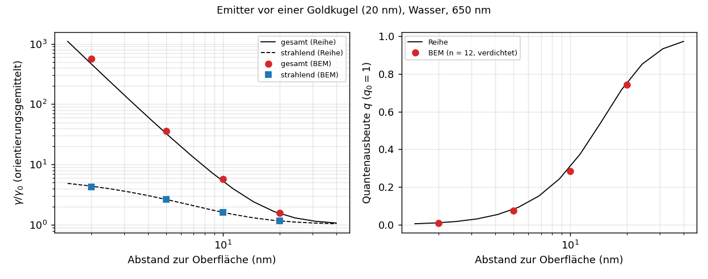

# Ergebnisse: Dipolanregung und Zerfallsraten von Emittern (v0.26)

Fluorophore vor Nanostrukturen: Das Teilchen verändert die Zerfallsraten eines Emitters (Purcell-Effekt, Quenching) und
damit seine Quantenausbeute. Die Formulierung bleibt unverändert; der Dipol ändert nur die rechte Seite
(`include/cbem/sources/dipole.hpp`, `solve_rhs` in `ScatteringProblem` und im Zweitor).

## Formulierung

Konventionen des Kerns (e^{−iωt}, ω = k₀, H so normiert, dass für die ebene Welle H = √(ε/μ) d × E gilt). Dipol p am Ort r₀
im achiralen Außenmedium, Strom J = −iω p δ(x − r₀), G = e^{ikr}/(4πr), n = (x − r₀)/r:

    H = ωk (n × p) G (1 − 1/(ikr)),
    E = (1/ε) [k² (n × p) × n + (3n(n·p) − p)(1/r² − ik/r)] G.

- **Projektion** der Spur F = √ε E + I √μ H auf die stückweise konstanten Dichten wie bei der ebenen Welle; Dreiecke nahe am
  Dipol werden adaptiv unterteilt (Unterteilung ∼ 4h/Abstand, Feld ∼ 1/r³).
- **Gesamtrate:** γ/γ₀ = 1 + 6πε Im(p*·E_s(r₀))/(k³|p|²) mit dem Streufeld am Dipolort (Nahfeld aus v0.24).
- **Strahlende Rate:** Fernfeldleistung von Dipol und Streufeld, integriert mit Gauß-Legendre in cos θ × gleichmäßig in φ
  (40 × 80), bezogen auf den freien Dipol mit derselben Quadratur (die Lebedev-Regel der Orientierungsmittelung mit
  höchstens 26 Richtungen reicht dafür nicht).
- **Nicht strahlende Rate** (Absorption im Körper, Quenching): gesamt − strahlend.
- **Quantenausbeute:** q = γ_rad/(γ_tot + (1 − q₀)/q₀) mit der intrinsischen Quantenausbeute q₀, Raten relativ zur strahlenden
  Rate des freien Emitters.

## Referenz

`tools/mie_dipole.py`: Reihenlösung für den radialen und den tangentialen Dipol vor einer (geschichteten) Kugel mit den
Mie-Koeffizienten a_n, b_n (Bohren–Huffman). Das Vorzeichen der Koeffizienten in den Ratenformeln unterscheidet sich zwischen
den Arbeiten; es wurde nicht vorausgesetzt, sondern über die verlustfreie Kugel bestimmt, bei der Gesamt- und strahlende Rate
gleich sein müssen: s = −1 erfüllt das auf 10⁻¹⁵ für beide Orientierungen, s = +1 ergäbe eine negative Rate. Dicht an der
Kugel laufen die Terme a_n h_n(kr₀)² in doppelter Genauigkeit über (a_n winzig, h_n riesig), obwohl gerade die Ordnungen
n ∼ R/(r₀ − R) das Quenching bestimmen; `rates_mp` rechnet daher mit `mpmath` (60 Stellen). Bei r₀ = 1,5 stimmen beide
Varianten auf acht Stellen überein; für r₀ → ∞ gehen beide Raten gegen 1.

## Validierung: Goldkugel in Wasser

ε = −11 + 1,2i, Radius 1, Wasser (ε₂ = 1,7689), ωa = 0,5. Relativer Fehler gegen die Reihenlösung, radial / tangential:

| d/a | Rate | gleichmäßig n = 8 | gleichmäßig n = 12 |
|---:|---|---:|---:|
| 1,0 | gesamt | −0,8 % / +1,2 % | −0,4 % / +0,5 % |
| 0,5 | gesamt | +1,0 % / +15,7 % | +0,5 % / +7,1 % |
| 0,25 | gesamt | +22 % / +100 % | +11 % / +50 % |
| 0,1 | gesamt | +260 % / +237 % | +175 % / +219 % |
| 0,05 | gesamt | +357 % / +152 % | +422 % / +242 % |
| 0,1–1,0 | strahlend | 1–3 % | 0,3–1,6 % |

- Die **strahlende Rate** ist ab d = 0,1 auf 1–3 % richtig.
- Die **Gesamtrate** (das Quenching) verlangt eine Auflösung des Abstands: Die induzierte Ladung ist auf einen Fleck der Größe
  etwa d konzentriert. Wo das Netz d auflöst, konvergiert sie mit Ordnung 2 (Fehlerverhältnis 2,1–2,2 für n = 8 → 12,
  (12/8)² = 2,25); der Vorfaktor ist groß und tangential größer als radial. Bei d ≲ h konvergiert sie nicht.

**Konform verdichtetes Netz** (`make_icosphere_graded`): stereographische Projektion vom Gegenpol, Skalierung mit λ < 1,
Rückprojektion. Elementgröße am Fußpunkt etwa λh, am Gegenpol h/λ, gleiche Dreieckszahl, Winkel erhalten. n = 12:

| d/a | λ | d/h_min | Gesamtrate | strahlende Rate |
|---:|---:|---:|---:|---:|
| 0,25 | 0,5 | 5,2 | +2,3 % / +13,7 % | −1,3 % / −1,3 % |
| 0,25 | 0,3 | 8,6 | **−0,6 % / +5,8 %** | −3,1 % / −2,4 % |
| 0,1 | 0,3 | 3,4 | +21 % / +34 % | −3,1 % / −2,6 % |
| 0,05 | 0,2 | 2,6 | +53 % / +60 % | −6,7 % / −4,6 % |

- Die Verdichtung verbessert die Gesamtrate um eine Größenordnung gegenüber dem gleichmäßigen Netz gleicher Größe. Die
  strahlende Rate verliert etwas, weil die Gegenseite gröber wird.
- **Faustregel:** Elementgröße am Fußpunkt etwa d/8 für wenige Prozent in der Gesamtrate (radial besser als tangential; die
  Anwendung unten zeigt, dass d/8 eher knapp ist).
  `dipole --graded auto` wählt λ danach, nicht unter 0,2, und meldet, wenn dafür ein feineres Grundnetz (größeres n) nötig ist.
- Verdichtete Netze sind langsamer (bei n = 12 etwa 140 s statt 40 s je Orientierung), weil die kleinen Elemente am Pol mehr
  Nahfeldeinträge der H-Matrix erzeugen.

## Anwendung: Fluorophor vor einer Goldkugel

Emitter bei 650 nm (etwa Cy5) vor einer Goldkugel (Radius 20 nm, Johnson–Christy, ε = −12,95 + 1,12i) in Wasser,
orientierungsgemittelt (γ⊥ + 2γ∥)/3, intrinsische Quantenausbeute q₀ = 1; n = 12, Netz automatisch zum Fußpunkt verdichtet
(`dipole --sphere 12 --unit 20 --materials Au --nbg 1.33 --lambda 650 --dist d --orient average`,
`results/dipole_au20_650.csv`, `tools/plot_dipole.py`):

| d | γ_tot BEM | Reihe | Fehler | γ_rad BEM | Reihe | Fehler | q BEM | q Reihe | h am Fußpunkt |
|---:|---:|---:|---:|---:|---:|---:|---:|---:|---:|
| 2 nm | 562 | 465 | +21 % | 4,28 | 4,38 | −2,5 % | 0,0076 | 0,0094 | d/5,1 |
| 5 nm | 36,0 | 32,6 | +10 % | 2,62 | 2,64 | −0,8 % | 0,073 | 0,081 | d/7,2 |
| 10 nm | 5,69 | 5,28 | +7,6 % | 1,61 | 1,61 | −0,3 % | 0,283 | 0,305 | d/7,4 |
| 20 nm | 1,56 | 1,54 | +1,6 % | 1,16 | 1,16 | −0,1 % | 0,743 | 0,756 | – |

- Unterhalb von etwa 10 nm dominiert die Absorption im Gold: Bei 2 nm ist die Gesamtrate 465-fach erhöht, aber nur knapp
  1 % davon wird abgestrahlt; bei 20 nm bleiben drei Viertel.
- Die strahlende Rate ist durchgehend auf 0,1–2,5 % genau. Die Gesamtrate liegt bei n = 12 um 8–21 % zu hoch, systematisch,
  weil die Auflösung am Fußpunkt nicht ganz reicht (bei 2 nm meldet die Anwendung, dass λ = 0,14 nötig wäre). Die Faustregel
  d/8 ist eher knapp, besonders für den tangentialen Dipol; für genaue Quantenausbeuten unter 5 nm n ≥ 16.
- Kosten: etwa 2–5 min je Abstand (beide Orientierungen, verdichtetes Netz n = 12).

## Grenzen

- Nur elektrische Dipole im achiralen Außenmedium, außerhalb aller Körper und Schichten. Magnetische Dipole, chirale Emitter
  und zirkular polarisierte Lumineszenz sowie Dipole innerhalb von Schichten sind nicht umgesetzt.
- Unter etwa 1 nm Abstand wird das klassische lokale Modell selbst fragwürdig (nichtlokale Antwort des Metalls,
  Elektronentunneln); das ist eine Grenze der Physik, nicht der Numerik.
- Die Orientierungsmittelung (γ⊥ + 2γ∥)/3 gilt für die Kugel und für schnell rotierende Emitter; für feste, zufällig
  orientierte Emitter wäre die Quantenausbeute je Orientierung zu mitteln.
