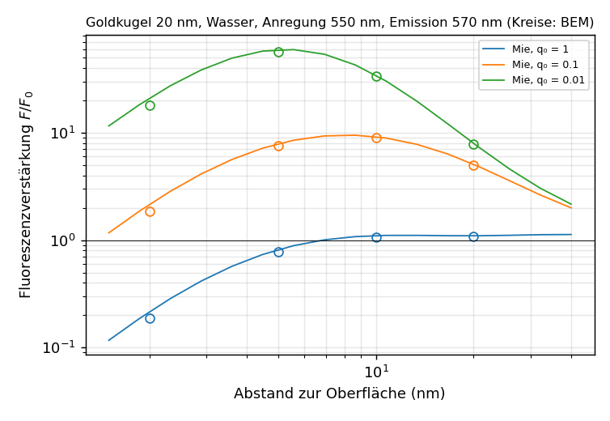

# Ergebnisse: Dipolanregung, Zerfallsraten und Fluoreszenzverstärkung von Emittern (v0.26–v0.32)

Fluorophore vor Nanostrukturen: Das Teilchen verändert die Zerfallsraten eines Emitters (Purcell-Effekt, Quenching) und
damit seine Quantenausbeute. Die Formulierung bleibt unverändert; der Dipol ändert nur die rechte Seite
(`include/cbem/sources/dipole.hpp`, `solve_rhs` in `ScatteringProblem` und im Zweitor).

## Formulierung

Konventionen des Kerns (e^{−iωt}, ω = k₀, H so normiert, dass für die ebene Welle H = √(ε/μ) d × E gilt). Dipol p am Ort r₀
im achiralen Außenmedium, Strom J = −iω p δ(x − r₀), G = e^{ikr}/(4πr), n = (x − r₀)/r:

    H = ωk (n × p) G (1 − 1/(ikr)),
    E = (1/ε) [k² (n × p) × n + (3n(n·p) − p)(1/r² − ik/r)] G.

- **Projektion** der Spur F = √ε E + I √μ H auf die stückweise konstanten Dichten wie bei der ebenen Welle; Dreiecke nahe am
  Dipol werden adaptiv unterteilt (Unterteilung ∼ 4h/Abstand, Feld ∼ 1/r³).
- **Gesamtrate:** γ/γ₀ = 1 + 6πε Im(p*·E_s(r₀))/(k³|p|²) mit dem Streufeld am Dipolort (Nahfeld aus v0.24).
- **Strahlende Rate:** Fernfeldleistung von Dipol und Streufeld, integriert mit Gauß-Legendre in cos θ × gleichmäßig in φ
  (40 × 80), bezogen auf den freien Dipol mit derselben Quadratur (die Lebedev-Regel der Orientierungsmittelung mit
  höchstens 26 Richtungen reicht dafür nicht).
- **Nicht strahlende Rate** (Absorption im Körper, Quenching): gesamt − strahlend.
- **Quantenausbeute:** q = γ_rad/(γ_tot + (1 − q₀)/q₀) mit der intrinsischen Quantenausbeute q₀, Raten relativ zur strahlenden
  Rate des freien Emitters.

## Referenz

`tools/mie_dipole.py`: Reihenlösung für den radialen und den tangentialen Dipol vor einer (geschichteten) Kugel mit den
Mie-Koeffizienten a_n, b_n (Bohren–Huffman). Das Vorzeichen der Koeffizienten in den Ratenformeln unterscheidet sich zwischen
den Arbeiten; es wurde nicht vorausgesetzt, sondern über die verlustfreie Kugel bestimmt, bei der Gesamt- und strahlende Rate
gleich sein müssen: s = −1 erfüllt das auf 10⁻¹⁵ für beide Orientierungen, s = +1 ergäbe eine negative Rate. Dicht an der
Kugel laufen die Terme a_n h_n(kr₀)² in doppelter Genauigkeit über (a_n winzig, h_n riesig), obwohl gerade die Ordnungen
n ∼ R/(r₀ − R) das Quenching bestimmen; `rates_mp` rechnet daher mit `mpmath` (60 Stellen). Bei r₀ = 1,5 stimmen beide
Varianten auf acht Stellen überein; für r₀ → ∞ gehen beide Raten gegen 1.

## Validierung: Goldkugel in Wasser

ε = −11 + 1,2i, Radius 1, Wasser (ε₂ = 1,7689), ωa = 0,5. Relativer Fehler gegen die Reihenlösung, radial / tangential:

| d/a | Rate | gleichmäßig n = 8 | gleichmäßig n = 12 |
|---:|---|---:|---:|
| 1,0 | gesamt | −0,8 % / +1,2 % | −0,4 % / +0,5 % |
| 0,5 | gesamt | +1,0 % / +15,7 % | +0,5 % / +7,1 % |
| 0,25 | gesamt | +22 % / +100 % | +11 % / +50 % |
| 0,1 | gesamt | +260 % / +237 % | +175 % / +219 % |
| 0,05 | gesamt | +357 % / +152 % | +422 % / +242 % |
| 0,1–1,0 | strahlend | 1–3 % | 0,3–1,6 % |

- Die **strahlende Rate** ist ab d = 0,1 auf 1–3 % richtig.
- Die **Gesamtrate** (das Quenching) verlangt eine Auflösung des Abstands: Die induzierte Ladung ist auf einen Fleck der Größe
  etwa d konzentriert. Wo das Netz d auflöst, konvergiert sie mit Ordnung 2 (Fehlerverhältnis 2,1–2,2 für n = 8 → 12,
  (12/8)² = 2,25); der Vorfaktor ist groß und tangential größer als radial. Bei d ≲ h konvergiert sie nicht.

**Konform verdichtetes Netz** (`make_icosphere_graded`): stereographische Projektion vom Gegenpol, Skalierung mit λ < 1,
Rückprojektion. Elementgröße am Fußpunkt etwa λh, am Gegenpol h/λ, gleiche Dreieckszahl, Winkel erhalten. n = 12:

| d/a | λ | d/h_min | Gesamtrate | strahlende Rate |
|---:|---:|---:|---:|---:|
| 0,25 | 0,5 | 5,2 | +2,3 % / +13,7 % | −1,3 % / −1,3 % |
| 0,25 | 0,3 | 8,6 | **−0,6 % / +5,8 %** | −3,1 % / −2,4 % |
| 0,1 | 0,3 | 3,4 | +21 % / +34 % | −3,1 % / −2,6 % |
| 0,05 | 0,2 | 2,6 | +53 % / +60 % | −6,7 % / −4,6 % |

- Die Verdichtung verbessert die Gesamtrate um eine Größenordnung gegenüber dem gleichmäßigen Netz gleicher Größe. Die
  strahlende Rate verliert etwas, weil die Gegenseite gröber wird.
- **Faustregel:** Elementgröße am Fußpunkt etwa d/8 für wenige Prozent in der Gesamtrate (radial besser als tangential; die
  Anwendung unten zeigt, dass d/8 eher knapp ist).
  `dipole --graded auto` wählt λ danach, nicht unter 0,2, und meldet, wenn dafür ein feineres Grundnetz (größeres n) nötig ist.
- Verdichtete Netze sind langsamer (bei n = 12 etwa 140 s statt 40 s je Orientierung), weil die kleinen Elemente am Pol mehr
  Nahfeldeinträge der H-Matrix erzeugen.

## Anwendung: Fluorophor vor einer Goldkugel

Emitter bei 650 nm (etwa Cy5) vor einer Goldkugel (Radius 20 nm, Johnson–Christy, ε = −12,95 + 1,12i) in Wasser,
orientierungsgemittelt (γ⊥ + 2γ∥)/3, intrinsische Quantenausbeute q₀ = 1; n = 12, Netz automatisch zum Fußpunkt verdichtet
(`dipole --sphere 12 --unit 20 --materials Au --nbg 1.33 --lambda 650 --dist d`,
`results/dipole_au20_650.csv`, `tools/plot_dipole.py`):

| d | γ_tot BEM | Reihe | Fehler | γ_rad BEM | Reihe | Fehler | q BEM | q Reihe | h am Fußpunkt |
|---:|---:|---:|---:|---:|---:|---:|---:|---:|---:|
| 2 nm | 562 | 465 | +21 % | 4,28 | 4,38 | −2,5 % | 0,0076 | 0,0094 | d/5,1 |
| 5 nm | 36,0 | 32,6 | +10 % | 2,62 | 2,64 | −0,8 % | 0,073 | 0,081 | d/7,2 |
| 10 nm | 5,69 | 5,28 | +7,6 % | 1,61 | 1,61 | −0,3 % | 0,283 | 0,305 | d/7,4 |
| 20 nm | 1,56 | 1,54 | +1,6 % | 1,16 | 1,16 | −0,1 % | 0,743 | 0,756 | – |

- Unterhalb von etwa 10 nm dominiert die Absorption im Gold: Bei 2 nm ist die Gesamtrate 465-fach erhöht, aber nur knapp
  1 % davon wird abgestrahlt; bei 20 nm bleiben drei Viertel.
- Die strahlende Rate ist durchgehend auf 0,1–2,5 % genau. Die Gesamtrate liegt bei n = 12 um 8–21 % zu hoch, systematisch,
  weil die Auflösung am Fußpunkt nicht ganz reicht (bei 2 nm meldet die Anwendung, dass λ = 0,14 nötig wäre). Die Faustregel
  d/8 ist eher knapp, besonders für den tangentialen Dipol; für genaue Quantenausbeuten unter 5 nm n ≥ 16.
- Kosten: etwa 2–5 min je Abstand (beide Orientierungen, verdichtetes Netz n = 12).

## Fluoreszenzverstärkung (v0.27)

Die Fluoreszenz eines Emitters nahe einem Teilchen setzt sich aus Anregung und Emission zusammen. Für einen fest, aber
zufällig orientierten Emitter (etwa ein gebundener Farbstoff) werden beide gemeinsam gemittelt:

    F/F₀ = Σ_a |E_a|² q_a / (|E₀|² q₀),   q_a = γ_rad,a / (γ_tot,a + (1 − q₀)/q₀),   a = x, y, z,

mit dem lokalen Feld E der ebenen Welle bei der Anregungswellenlänge am Emitterort und den Raten bei der Emissionswellenlänge
(`fluorescence_enhancement`; das Produkt der Mittelwerte wäre etwas anderes). Die Raten hängen nicht von q₀ ab, daher liefert
eine Rechnung F/F₀ für beliebige q₀ (`tools/plot_fluorescence.py`). `dipole --lambda-exc … --exc-dir … --exc-pol …`; liegt der
Emitter auf der x-Achse einer Kugel oder in der Spaltmitte eines Dimers, sind y und z gleichwertig und werden nur einmal
gerechnet.

**Einzelkugel** (Gold, Radius 20 nm, Wasser; Anregung 550 nm, Emission 570 nm, etwa Cy3; x-polarisiert entlang z; n = 12,
verdichtet; `results/fluor_sphere_550_570.csv`):

| d | Anregung \|E_x\|² BEM / Mie | F/F₀, q₀ = 1 | q₀ = 0,1 | q₀ = 0,01 |
|---:|---:|---:|---:|---:|
| 2 nm | 27,3 / 28,7 | 0,19 / 0,22 | 1,9 / 2,1 | 18 / 21 |
| 5 nm | 15,5 / 15,8 | 0,78 / 0,82 | 7,5 / 7,9 | 57 / 59 |
| 10 nm | 7,37 / 7,43 | 1,07 / 1,10 | 8,9 / 9,2 | 34 / 34 |
| 20 nm | 2,99 / 3,01 | 1,08 / 1,10 | 5,0 / 5,1 | 7,9 / 8,0 |

- Für helle Farbstoffe (q₀ = 1) hebt das Quenching die stärkere Anregung auf; F/F₀ bleibt unter 1,1. Schwache Emitter gewinnen
  bis etwa 60-fach, mit einem Optimum bei 10 nm (q₀ = 0,1) bzw. 5 nm (q₀ = 0,01).
- Ab 5 nm stimmt die BEM auf 1–5 % mit Mie überein; bei 2 nm liegt sie 13 % zu tief, weil das Quenching bei h ≈ d/6 am Fußpunkt
  überschätzt wird.

**Gold-Dimer** (2 × 20 nm, 4 nm Spalt zwischen den Kernen, Emitter in der Spaltmitte, 2 nm zu jeder Oberfläche; Anregung
580 nm entlang z, x-polarisiert (entlang der Achse); Emission 600 nm; `results/fluor_dimer_580_600.csv`), verglichen mit der
Einzelkugel bei 2 nm unter denselben Wellenlängen (`results/fluor_sphere_580_600.csv`):

| | Einzelkugel, 2 nm | Dimer, Spaltmitte |
|---|---:|---:|
| Anregung \|E_x\|²/\|E₀\|² | 20,9 | 2 394 |
| γ_tot (Dipol entlang x) | 1 842 | 13 551 |
| γ_rad (Dipol entlang x) | 17,2 | 1 463 |
| q_x (q₀ = 1) | 0,0094 | 0,108 |
| F/F₀ (q₀ = 1) | 0,20 | ≈ 260 |

- Der Dimer verstärkt nicht nur die Anregung; er ist zugleich eine gute Antenne: Die strahlende Rate des Dipols entlang der
  Achse steigt fast 90-mal stärker als bei der Einzelkugel, die Quantenausbeute bleibt trotz des Quenchings zwölfmal höher.
  Selbst ein heller Farbstoff wird um mehr als zwei Größenordnungen verstärkt. Senkrecht zur Achse orientierte Emitter werden
  weder angeregt noch abgestrahlt (q ≈ 2·10⁻⁴).
- Unsicherheit: Für den Dimer gibt es keine Referenz. Bei 2 nm erreicht die Verdichtung auf n = 12 nur etwa d/6 am Fußpunkt
  (bei der Einzelkugel in dieser Lage 13–20 % Fehler), und das Spaltfeld verlangt feinere Netze (`results_nearfield.md`).
  F/F₀ ≈ 260 ist als Größenordnung mit etwa ±30 % zu verstehen; eine Konvergenzprüfung mit n = 16 steht aus.
- `test_dipole` prüft F/F₀ für die Kugel gegen Mie (d = 0,5 Radien, q₀ = 0,1: −5,1 % bei n = 8, verdichtet; der größere Teil
  kommt aus der Anregung auf dem groben Netz, −2,9 %).

## Chirale Emitter und zirkular polarisierte Lumineszenz (v0.32)

Chirale Emitter haben neben dem elektrischen Übergangsdipol p einen magnetischen m. Der magnetische Dipol folgt aus dem
elektrischen über die Dualität (E → H, H → −E, ε ↔ μ, p → m):

    H_m = (1/μ) [k² (n × m) × n + (3n(n·m) − m)(1/r² − ik/r)] G,   E_m = −ωk (n × m) G (1 − 1/(ikr)).

Mit dieser Normierung strahlt m im Vakuum wie p gleichen Betrags. Gesamtrate:

    γ/γ₀ = 1 + [Im(p*·E_s) + Im(m*·H_s)] / [k³|p|²/(6πε) + k³|m|²/(6πμ)]

(gleicher Vorfaktor nach der Dualität; in der Gesamtleistung keine Kreuzterme, weil die Abstrahlmuster von p und m entgegengesetzte
Parität haben). Zirkular polarisierte Lumineszenz: Das gesamte Fernfeld E∞ (frei und gestreut) wird als F' = √ε(E∞ + I x̂ × E∞)
mit P± in die Helizitäten zerlegt, g_lum = 2(P₊ − P₋)/(P₊ + P₋); P₊ + P₋ ist exakt die strahlende Rate. Beschriftung der
Helizität wie `circular_polarization` und beim CD. `dipole_rates(…, md)`, `project_dipole(…, md)`, `dipole --chiral κ`
(m = iκ√(μ/ε) p, parallele Übergangsdipole).

**Prüfsteine** (`test_dipole`):

| Fall | BEM | erwartet |
|---|---:|---:|
| Helizitätsdipol m = +i√(μ/ε) p, ohne Streuer | g_lum = −2,000000, Raten 1 | rein eine Helizität (x̂ × E = +iE, in der Beschriftung s = −1) |
| m = −i√(μ/ε) p | +2,000000 | |
| schwach chiral, κ = 0,01 | \|g_lum\| = 0,03999600 | 4κ/(1 + κ²) = 0,03999600 |
| magnetischer Dipol vor Gold (ε = −11 + 1,2i), r₀ = 1,5, radial | 0,9320 / 0,8887 | Mie (a_n ↔ b_n): 0,9261 / 0,8872 |
| dto. tangential | 2,933 / 2,646 | 2,952 / 2,690 |

Für den gemeinsamen Emitter aus p und m vor der Kugel gibt es keine eigene Referenz; beide Teile sind einzeln gegen Mie geprüft,
ihre relative Phase über den freien Helizitätsdipol, und die Fernfelder sind linear.

**Anwendung: chiraler Emitter vor Gold** (κ = 0,01, frei g_lum = −0,040; Emission 600 nm, Wasser, n = 12 verdichtet;
`results/cpl_sphere_600.csv`, `results/cpl_dimer_600.csv`):

| Ort | g_lum radial bzw. entlang der Achse | tangential bzw. senkrecht | gemittelt | Verhältnis zu frei |
|---|---:|---:|---:|---:|
| Kugel (20 nm), d = 20 nm | −0,025 | −0,053 | −0,035 | 0,87 |
| Kugel, d = 5 nm | −0,012 | −0,075 | −0,013 | 0,32 |
| Dimer (4 nm Spalt), Spaltmitte | −0,00083 | **+0,093** | −0,00080 | 0,02 |

- Radial bzw. entlang der Dimerachse orientierte Emitter verlieren Chiralität: Die elektrische Abstrahlung wird stark verstärkt
  (im Spalt γ_rad = 1 463), die magnetische kaum, das Verhältnis beider Anteile sinkt.
- Tangential bzw. senkrecht zur Achse orientierte Emitter gewinnen: Ihre elektrische Abstrahlung wird vom Spiegelbild im Metall
  nahezu ausgelöscht (Kugel bei 5 nm γ_rad = 0,05, Spalt 0,27), ein tangentialer magnetischer Dipol strahlt vor Metall eher
  verstärkt. Im Spalt wechselt g_lum dabei das Vorzeichen: Die Umgebung verschiebt die Phase zwischen elektrischem und
  magnetischem Anteil so, dass die Interferenz der Helizitätsanteile umkehrt. Gegenprüfung mit feinerem Netz (n = 16, h am
  Fußpunkt etwa d/7,6 statt d/5,7; `results/cpl_dimer_600_n16.csv`):

  | Größe | n = 12 | n = 16 |
  |---|---:|---:|
  | g_lum senkrecht zur Achse | +0,09332 | +0,09366 (+0,4 %) |
  | g_lum entlang der Achse | −0,00083 | −0,00081 |
  | g_lum gemittelt | −0,00080 | −0,00078 |
  | γ_rad senkrecht / entlang | 0,2695 / 1 463 | 0,2692 / 1 532 |
  | γ_tot senkrecht / entlang | 1 306 / 13 550 | 1 245 / 13 587 |

  Der Vorzeichenwechsel ist damit robust: g_lum ändert sich um 0,4 %, die Raten um höchstens etwa 5 %.
- Im Orientierungsmittel dominieren die stark strahlenden radialen bzw. axialen Emitter: Achirale plasmonische Strukturen
  verdünnen die zirkular polarisierte Lumineszenz eines chiralen Emitters (Kugel bei 5 nm auf ein Drittel, im Spalt auf 2 %),
  obwohl einzelne Orientierungen verstärkt werden.

## Krylov-Recycling für mehrere rechte Seiten (v0.28)

`RecyclingGmres` (`include/cbem/solvers/recycling_gmres.hpp`, GCRO-Prinzip) speichert einen Unterraum U und C = B·U mit
orthonormalem C (B = A·M, rechts vorkonditioniert) und löst jede neue rechte Seite auf dem deflationierten Operator
(I − C·Cᴴ)·B; die Richtungen früherer Lösungen werden angehängt, bis eine Obergrenze erreicht ist.
`ScatteringProblem::use_recycling()` und `TwoPortLayerProblem::use_recycling()` schalten es für folgende Lösungen ein.

**Zeitaufteilung je Emitterort** (Goldkugel, n = 12, verdichtet, drei Orientierungen, vor dem Recycling gemessen): Aufbau 30 s
(27 %), Lösen 3 × etwa 46 Iterationen 59 s (53 %), Raten 24 s (21 %, überwiegend die Fernfeldintegration der strahlenden Rate
über 3 200 Richtungen).

**Wirkung** (dieselben Lösungen wie GMRES auf 10⁻¹⁰; neun rechte Seiten: drei Orientierungen, dann sechs weitere Orte auf
demselben Netz):

| Fall | Iterationen ohne → mit Recycling | Lösezeit gesamt |
|---|---|---:|
| Gold, ε = −11 + 1,2i, n = 12 | 45, 46, 47, 50 … → 45, **52**, 47, 37–41 | 1,11-fach |
| nahe der Plasmonresonanz, ε = −3,5 + 0,3i, n = 8 | 73, 67, 68, 82–83 … → 73, 66, 66, **54–60** | 1,19-fach |
| Testmatrix mit 8 Ausreißer-Eigenwerten nahe 0 (`test_recycling`) | 89, 89, 89, 89 → 89, **25, 24, 23** | 3,6-fach (ab der 2.) |

- Das Recycling arbeitet wie vorgesehen, wo wenige langsame Eigenrichtungen die Konvergenz bestimmen (Testmatrix). Beim
  Dipolproblem ist der Gewinn klein: Der vorkonditionierte Operator ist von zweiter Art ohne ausgeprägte Ausreißer (gleichmäßige
  Reduktion um etwa 0,63 je Iteration), und die lokalisierten Dipolanregungen haben wenig überlappende Krylov-Räume. Für die
  zweite rechte Seite braucht es bei ε = −11 sogar mehr Iterationen (der deflationierte Raum enthält K_m(B, b) nicht).
- Nahe einer Plasmonresonanz, wo der Operator nahezu singuläre Moden hat, sparen spätere rechte Seiten bis zu einem Drittel.
- Die einfache Variante speichert rohe Krylov-Vektoren, bis die Obergrenze erreicht ist, und nimmt danach nichts mehr auf.
  GCRO-DR behielte stattdessen eine feste Zahl von Näherungen der Eigenvektoren zu den kleinsten Eigenwerten (harmonische
  Ritz-Vektoren) und aktualisierte sie laufend; das wäre der Schritt, falls sich Recycling bei resonanten Problemen mit vielen
  rechten Seiten lohnen soll.
- Für die Anwendung `dipole` (zwei bis drei Orientierungen je Ort, Netz je Ort neu verdichtet) ist es nicht eingeschaltet.

### GCRO-DR (v0.29)

`GcroDr` behält statt aller rohen Krylov-Vektoren eine feste Zahl k von Richtungen, die harmonischen Ritz-Vektoren zu den
betragskleinsten Eigenwerten des erweiterten Systems, und bestimmt sie nach jedem Zyklus neu (Parks, de Sturler, Mackey, Johnson,
Maiti 2006). Zyklus der Länge m − k auf (I − C·Cᴴ)·B mit B·[Ũ V] = [C V₊]·Ḡ, Ḡ = [[D, E], [0, H̄]]; harmonische Ritz-Vektoren
aus Ḡᴴ·Ḡ·z = θ·Ḡᴴ·Ŵᴴ·V̂·z, gelöst als (ḠᴴḠ)⁻¹·Ḡᴴ·Ŵᴴ·V̂·z = μ·z mit den k größten |μ| (ḠᴴḠ ist hermitesch positiv definit und
sicher invertierbar, Ḡᴴ·Ŵᴴ·V̂ nicht unbedingt); neuer Unterraum Ḡ·P = Q·R, C = Ŵ·Q, U = V̂·P·R⁻¹. Der erste Zyklus ohne
Unterraum ist GMRES-DR. Dafür neu: `eig_complex` (Householder-Hessenberg, verschobener QR-Algorithmus, Eigenvektoren aus der
Schur-Form; Residuum 10⁻¹³ bei n = 80). `use_gcrodr(k, m)` in `ScatteringProblem` und Zweitor.

| Fall | GMRES | einfache Variante (Richtungen) | GCRO-DR |
|---|---|---|---|
| Testmatrix, 8 Ausreißer | 89 je rechte Seite | 23–25 (114–161) | k = 10: **28–29**, erste Lösung 91 trotz Neustart nach 40 |
| Gold nahe der Resonanz, spätere Orte | 82–83 | 54–60 (139), gesamt 1,19-fach | k = 20: 50–53, **1,30-fach**; k = 40: 46–53, 1,34-fach |
| Gold nahe der Resonanz, Orientierungen 2 und 3 | 67–68 | 66 | 68–69 |
| Gold, ε = −11 + 1,2i, n = 12 | 45–50 | gesamt 1,11-fach | k = 20: 40–51, 1,09-fach |

- GCRO-DR erreicht mit einem Zehntel bis Siebtel des Speichers dasselbe oder mehr als die einfache Variante; die Lösungen
  stimmen auf 10⁻⁹ bis 10⁻¹² mit GMRES überein.
- Wo es langsame Eigenrichtungen gibt (Ausreißer, Plasmonresonanz), spart es bei späteren rechten Seiten bis gut 40 %. Ohne
  solche Richtungen (Gold bei ε = −11) bleibt der Gewinn bei 10 %.
- Die Orientierungen eines Dipols am selben Ort profitieren in keinem Fall: Ihre Anregungen teilen wenig Krylov-Raum, und die
  herausgenommenen langsamen Moden bestimmen ihre Konvergenz kaum. Für die Anwendung `dipole` bleibt Recycling deshalb aus;
  sinnvoll ist es für viele rechte Seiten auf demselben Netz nahe einer Resonanz (etwa Karten über viele Emitterorte).
- Mehr gespeicherte Richtungen helfen kaum (k = 40 statt 20: 1,34- statt 1,30-fach).

## Grenzen

- Elektrische und magnetische Dipole im achiralen Außenmedium, außerhalb aller Körper und Schichten; Dipole innerhalb von
  Schichten und in chiralen Außenmedien sind nicht umgesetzt.
- Unter etwa 1 nm Abstand wird das klassische lokale Modell selbst fragwürdig (nichtlokale Antwort des Metalls,
  Elektronentunneln); das ist eine Grenze der Physik, nicht der Numerik.
- Die Orientierungsmittelung (γ⊥ + 2γ∥)/3 gilt für die Kugel und für schnell rotierende Emitter; für feste, zufällig
  orientierte Emitter wäre die Quantenausbeute je Orientierung zu mitteln.
