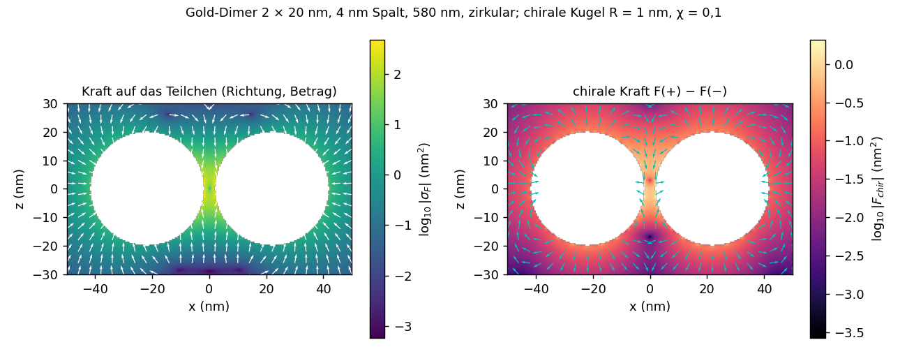

# Ergebnisse: Optische Kräfte (v0.33, Dipolnäherung v0.34, Kraftkarten v0.35)

Kräfte auf die BEM-Körper über den Maxwellschen Spannungstensor (`include/cbem/sources/optical_force.hpp`), zeitgemittelt,
ε₀ = μ₀ = 1, achirales Außenmedium:

    ⟨T⟩ = ½ Re[ε E ⊗ E* + μ H ⊗ H* − ½(ε|E|² + μ|H|²) I],   F = ∮_S ⟨T⟩·n dS

über eine geschlossene Fläche S im Außenraum, die genau den betrachteten Körper umschließt. Drei Wege:

- **Randspuren** (`force_from_traces`): S ist die Körperfläche selbst, Felder aus den stückweise konstanten Außenspuren; ohne
  Nahfeldauswertung, je Körper.
- **Kugel** (`force_on_sphere`): Kugel um den Körper bzw. um alle Körper, Gauß-Legendre × gleichmäßig in φ, Felder aus dem Nahfeld.
- **Parallelfläche** (`force_on_offset`): Parallelfläche des Körpers im Abstand δ (bei einem Dimer kleiner als der halbe Spalt),
  7-Punkt-Regel, Felder aus dem Nahfeld.

Normierung: Eine ebene Welle der Amplitude |E₀| trägt die Impulsstromdichte ½ε|E₀|²; der Strahlungsdruck auf einen Körper ist
F_z = σ_pr·½ε|E₀|² mit σ_pr = σ_ext − ⟨cos θ⟩ σ_sca (Referenz `tools/mie_force.py`, Bohren–Huffman; verlustfreie Kugel:
σ_ext = σ_sca auf zehn Stellen).

## Strahlungsdruck auf eine Goldkugel

ε = −11 + 1,2i, Radius 1, Wasser, ωa = 0,5, Einfall entlang z, x-polarisiert; Mie: F_z = 10,6298.

| Weg | n = 8 | n = 12 |
|---|---:|---:|
| Randspuren | 10,4498 (−1,69 %) | 10,5487 (−0,76 %) |
| Kugel R = 1,5 | 10,4680 (−1,52 %) | 10,5569 (−0,69 %) |
| Kugel R = 3 | 10,4828 (−1,38 %) | 10,5635 (−0,62 %) |
| Parallelfläche δ = 0,2 | 10,4656 (−1,55 %) | 10,5558 (−0,70 %) |
| Parallelfläche δ = 0,05 | 10,4640 (−1,56 %) | 10,5550 (−0,70 %) |

Die Wege stimmen untereinander auf etwa 0,3 % überein; die Abweichung gegen Mie ist der Diskretisierungsfehler der Streulösung
selbst (σ_ext auf denselben Netzen −1,4 bzw. −0,6 %). Die Integration des Spannungstensors fügt praktisch keinen Fehler hinzu.
Querkräfte verschwinden (10⁻⁵ bis 10⁻⁸).

## Optische Bindung am Gold-Dimer

Zwei Goldkugeln (Radius 1) mit Spalt 0,3 entlang x in Wasser, Einfall entlang z, n = 8; Parallelfläche δ = 0,06:

| | Polarisation entlang der Achse | senkrecht |
|---|---:|---:|
| Kraft entlang der Achse auf Kugel 1 / 2 | +43,26 / −43,26 | −0,50 / +0,50 |
| Kraft in Einfallsrichtung je Kugel | 17,89 | 8,02 |
| Summe beider Kugeln / Kugel um beide | 35,78 / 35,81 | 16,03 / 16,07 |

- Entlang der Achse polarisiert ziehen sich die Kugeln stark an; die Bindungskraft ist 2,4-mal größer als der Strahlungsdruck.
  Senkrecht polarisiert stoßen sie sich schwach ab (nebeneinander schwingende Dipole).
- Die Bindungskräfte sind entgegengesetzt gleich, und die Summe der Einzelkräfte trifft die Kraft auf die umschließende Kugel auf
  0,1–0,2 % (n = 6: 0,4 %). Randspuren und Parallelfläche stimmen auf 0,3–0,8 % überein.

## Kraft auf kleine, auch chirale Teilchen in Dipolnäherung (v0.34)

Ein kleines Teilchen antwortet mit den dualen Größen e = √ε E, h = √μ H

    p/√ε = A_e e + i A_c h,   m/√μ = A_m h − i A_c e,

die zeitgemittelte Kraft ist

    F = ½ Re[Σ_j p_j ∇E_j* + Σ_j m_j ∇H_j*] − (ωk³/12π) Re(p × m*)

(`dipole_particle_force`; der letzte Term ist der Rückstoß durch die Interferenz von p und m, hergeleitet aus der Impulsbilanz im
Fernfeld). E, H und ihre Gradienten kommen aus dem Nahfeld mit zentralen Differenzen (`fields_with_gradients`, sieben Punkte je
Ort). Das Teilchen wirkt nicht auf das Feld zurück.

**Polarisierbarkeiten** (`tools/mie_polarizability.py`): aus den Koeffizienten n = 1 der chiralen Mie-Lösung. Für eine einfallende
Helizitätswelle (Beschriftung s) ist h = −is·e, die Polarisierbarkeit derselben Helizität A_s = (A_e + A_m)/2 + s·A_c, also
A_c = (A₊ − A₋)/2. Die Abbildung der Mie-Koeffizienten auf Bohren–Huffman ist am achiralen Grenzfall bestimmt (an/C = −b₁,
bn/C = −s a₁), nicht vorausgesetzt. Achiral: A_e = 6πi a₁/k³, A_m = 6πi b₁/k³ (`polarizability_from_mie`).

**Prüfungen** (`test_optical_force`):

| Fall | Ergebnis |
|---|---|
| ebene Welle, Kugel R = 0,3, ε = 4 (merklicher magnetischer Anteil) | Dipolformel = Mie-Strahlungsdruck mit n = 1 (einschließlich Re(a₁b₁*)) auf 7·10⁻⁸ |
| kleine Glaskugel (R = 0,08) 0,32 Radien vor einer Goldkugel, drei Orte | gegen die volle BEM-Rechnung beider Körper (Spannungstensor) auf 0,9–1,2 % in Betrag und Richtung |
| kleine chirale Kugel (χ = ±0,2) vor Gold, zirkular polarisiert | Kraft auf 1,1 %, Differenz der Enantiomere F(+χ) − F(−χ) auf 1,8 % (auch die kleine Querkomponente) |

- Die Gradientenkraft zieht die kleine Kugel zur Feldüberhöhung der Goldkugel hin.
- Die enantioselektive Kraft macht bei χ = 0,2 etwa 15 % der Gesamtkraft aus und ist linear in χ.
- Der Rest von etwa 1 % gegen die volle Rechnung passt zur Diskretisierung der kleinen Kugel (n = 6) und zur vernachlässigten
  Rückwirkung zwischen den Teilchen. Die Dipolnäherung erlaubt Kraftkarten aus einer einzigen Lösung der Nanostruktur.

## Enantioselektive Kraft im Spaltfeld (v0.35)

Kraftkarten aus einer einzigen Lösung der Nanostruktur: `nearfield --particle "Ae,Am,Ac"` (Polarisierbarkeiten in Einheiten des
Netzes, aus `tools/mie_polarizability.py`) gibt je Punkt den Kraftquerschnitt σ_F = F/(½ε|E₀|²) in nm² und die chirale Kraft
F(A_c) − F(−A_c), die Differenz der Enantiomere; `tools/plot_force.py` zeichnet beide und vergleicht die chirale Kraft mit dem
Gradienten der optischen Chiralität C derselben Karte.

Gold-Dimer (2 × 20 nm, 4 nm Spalt) in Wasser bei 580 nm (gekoppelte Mode), zirkular polarisiert, Einfall entlang z; chirale Kugel
R = 1 nm, ε = 2,25, χ = 0,1 (bewusst groß gewählt, die chirale Kraft ist linear in χ): A_e = 1,297·10⁻⁴, A_m = −9,0·10⁻⁷,
A_c = 3,612·10⁻⁵ (Einheiten des Netzes, Länge 20 nm); n = 8 (`results/force_dimer_580.csv`, Spalt fein `results/force_gap_580.csv`):

- Die Gradientenkraft zieht das Teilchen in den Spalt; der Kraftquerschnitt erreicht dort 473 nm², bei 3 nm² geometrischem
  Querschnitt.
- Die chirale Kraft erreicht 4,7 nm², etwa 1 % der Gesamtkraft, am größten rund um den Spalt; im Spalt bei z ≈ 3 nm hat sie einen
  Nullpunkt, wo die optische Chiralität extremal ist.
- **Sie folgt dem Gradienten der optischen Chiralität:** antiparallel zu ∇C (gewichteter Kosinus −0,9998, Median −1,0000) mit
  einem einzigen Faktor −0,575 nm³ (Rest 3,4 %; im fein aufgelösten Spalt −0,579 nm³, Rest 0,9 %). Aus der Kraftformel folgt
  für fast reelles A_c F_chir = −½√(εμ) A_c ∇Im(E*·H), die Differenz der Enantiomere ist das Doppelte; in den Einheiten der
  Karte −2 Re(A_c) L³ ∇C = −0,578 nm³ (L = 20 nm). Das trifft die Anpassung auf 0,1–0,5 %; der kleine Rest stammt aus Im(A_c),
  dem Rückstoßterm und den Differenzenquotienten.
- Das Enantiomer mit A_c > 0 wird zur betragsmäßig größten Chiralität im Spalt hingezogen, das andere herausgedrückt
  (Grundlage einer enantioselektiven optischen Falle). Gegenüber der Gradientenkraft ist der Effekt klein (1 %); er wächst
  linear mit der Chiralität des Teilchens und der Chiralität des Feldes.
- Kosten: 24 321 Punkte (14 263 gültig, sieben Feldauswertungen je Punkt) in 42 s nach einer Lösung von 60 s.

## Grenzen

- Nur achirale Außenmedien (der Spannungstensor im Pasteur-Medium ist ein anderer); Anregung durch ebene Wellen.
- Dipolnäherung ohne Rückwirkung des Teilchens auf das Feld; für größere Teilchen oder sehr kleine Abstände die volle Rechnung.
