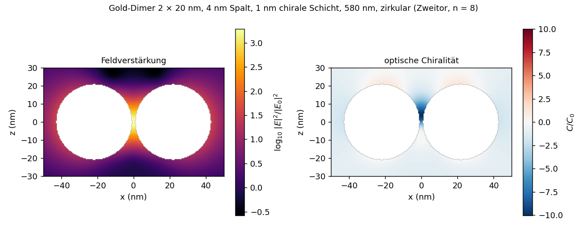
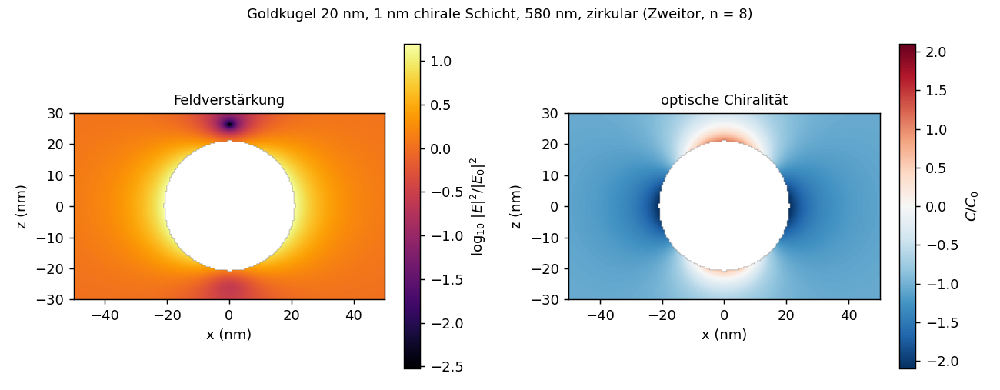

# Ergebnisse: Nahfeld im Außenraum (v0.24)

Das Streufeld an einem Punkt x außerhalb aller Körper ist das Cauchy-Integral der Streuspur h_s = h − h_inc auf der Fläche
zum Außenraum (`include/cbem/sources/near_field.hpp`):

    F_s(x) = Σ_τ ∫_τ Φ_k(x − y) dS_y · n_τ u_τ ,   Φ_k = −(∇ + ik) e^{ik|z|}/(4π|z|).

- **Vorzeichen:** Meine erste Herleitung über die Plemelj-Grenzwerte ergab −1; zwei unabhängige numerische Prüfungen zeigen +1.
  Die Fernfeldgrenze R e^{−ikR} F_s(R x̂) → F_∞(x̂) stimmt auf 7,6·10⁻⁴, und dicht an der Oberfläche gibt F_s die Streuspur
  bis auf die Diskretisierung wieder (3–4 %). Die Darstellung ist damit konsistent mit `far_field` und dem optischen Theorem.
- **Quadratur:** fern die 7-Punkt-Regel mit dem vollen Kern; nah (Abstand < 4 Umkreisradien) die Zerlegung
  Φ_k = Φ₀ + (−ik/4πr) + Rest mit analytischen Dreiecksintegralen für die singulären Anteile und der 7-Punkt-Regel für den
  glatten Rest.
- **Chirales Außenmedium:** je Helizität mit k± und P± h_s.
- **Größen:** E = vec(F)/√ε, H aus dem Bivektoranteil; Feldverstärkung |E|²/|E₀|² und optische Chiralität
  C/C₀ = Im(E*·H)/|Im(E₀*·H₀)| relativ zur zirkular polarisierten ebenen Welle desselben Mediums (die einfallende Welle
  mit s = +1 hat C/C₀ = −1).
- **Markierungen:** Punkte innerhalb eines Körpers (Windungszahl der Außenfläche > ½) und Punkte näher als 2 % der
  Elementgröße am Netz werden markiert und in Karten und Maxima ausgelassen. Stückweise konstante Dichten springen an den
  Elementkanten; das Cauchy-Integral hat dort logarithmische Spitzen. Ein Gitterpunkt genau auf einem Knoten ergab sonst
  |E|² = 151 statt 22, schon 0,1 nm (3 % der Elementgröße) weiter außen stimmt der Wert (21,2 gegen 21,9).
- **Aufruf:** `nearfield` (Karte in einer Ebene, CSV) und `tools/plot_nearfield.py` (Abbildung); Referenz
  `tools/mie_nearfield.py` (vektorielle Kugelwellen nach Bohren–Huffman, auch für geschichtete Kugeln außerhalb der
  äußeren Fläche; Selbsttest: die Entwicklung der einfallenden Welle stimmt auf 10⁻¹⁵).

## Validierung gegen Mie

Goldkugel (ε = −11 + 1,2i, Radius 1) in Wasser, ωa = 0,5, zirkular polarisiert, relativer Fehler des Feldvektors E:

| Abstand zur Oberfläche | n = 8 | n = 12 |
|---:|---:|---:|
| 0,02 (0,15 h bei n = 8) | 1,2–4,0 % | 0,4–1,3 % |
| 0,05 | 0,9–1,9 % | 0,5–1,2 % |
| 0,2 | 1,4–4,6 % | 0,6–2,1 % |
| 1,0 | 0,6–1,0 % | 0,3–0,4 % |

Der Fehler fällt mit dem Netz, auch dicht an der Oberfläche. Feldverstärkung am Pol in Polarisationsrichtung
(|E|²/|E₀|² ≈ 21) und optische Chiralität (C/C₀ ≈ −2,0) treffen Mie auf etwa 1 % (n = 12). Beschichtete Kugel (Zweitor,
Glasschale 0,05): |E|² bei r = 1,2 auf −2,3 % (n = 8, `test_near_field`).

## Anwendung: Spaltfeld des Gold-Dimers mit chiraler Schicht

Zwei Goldkugeln (Radius 20 nm) in Wasser, 4 nm Spalt zwischen den Kernen, 1 nm chirale Schicht, 580 nm (gekoppelte Mode),
zirkular polarisiert, Einfall senkrecht zur Achse (`nearfield --sphere 8 --sphere-dimer 4 --coating "1:2.25,0:0.01"
--lambda 580 --pol circ --plane xz`, `results/nf_dimer_580.csv`):

- Die Feldverstärkung konzentriert sich im Spalt (|E|²/|E₀|² bis etwa 2 000, Einzelkugel 16). Die optische Chiralität ist im
  Spalt stark negativ (C/C₀ bis etwa −8 … −10, Einzelkugel −2,1) und reicht als Fahne entlang der Einfallsrichtung nach oben;
  über den Kugeln ist sie schwach positiv. Chirale Moleküle im Spalt werden also bis zu zehnmal stärker chiral angeregt als in
  der einfallenden Welle; das erklärt die Verstärkung des CD des Dimers (`results_coated.md`).
- C/C₀ beschreibt die Verdrillung des lokalen Feldes, nicht eine Eigenschaft der Moleküle.

**Konvergenz im Spalt** (Spaltmitte, Zweitor gegen Dünnschicht-Näherung zweiter Ordnung als unabhängige Gegenprobe):

| n | \|E\|²/\|E₀\|² Zweitor | Dünnschicht | Abstand | C/C₀ Zweitor | Dünnschicht |
|---:|---:|---:|---:|---:|---:|
| 8 | 1 829 | 1 488 | −19 % | −6,50 | −7,20 |
| 10 | 1 929 | 1 649 | −15 % | −6,95 | −7,38 |
| 12 | 1 978 | 1 748 | −12 % | −7,20 | −7,49 |
| extrapoliert (Ordnung 2) | ≈ 2 090 | ≈ 1 970 | ≈ −6 % | ≈ −7,77 | ≈ −7,74 |

Beide Verfahren konvergieren aufeinander zu, die optische Chiralität extrapoliert auf 0,4 %, die Feldverstärkung auf etwa
6 %. Das Spaltfeld verlangt feinere Netze als die Spektren: Die Punkte liegen etwa 0,4 Elementgrößen von den Flächen, und
das Feld ändert sich auf der Skala des Spalts; zudem liegt 580 nm am Maximum einer schmalen Resonanz, deren Lage sich zwischen
den Verfahren und mit dem Netz leicht verschiebt. Auf n = 8 ist |E|² im Spalt auf 10–20 %, C auf etwa 10 % genau; für
quantitative Spaltwerte n ≥ 12 und Extrapolation.

## Kosten und Grenzen

- Direkte Summation über alle Dreiecke: 24 321 Punkte bei 2 × 2 × 1 280 Dreiecken in 17 s (ein Kern); für sehr viele Punkte
  wäre eine H-Matrix- oder FMM-Auswertung der nächste Schritt.
- Nur der Außenraum: Felder in Kernen und Schichten sind nicht ausgegeben (für homogene Körper wären sie über den Innenoperator
  zugänglich, im Zweitor zwischen den Schichtgrenzen nur über die Schichtbeziehung).
- Die Dünnschicht-Näherung stellt das Außenfeld von der Referenzfläche aus dar (fortgesetzt durch die Schicht); gültig
  außerhalb der Hülle, innere Punkte werden über die Hülle markiert.
