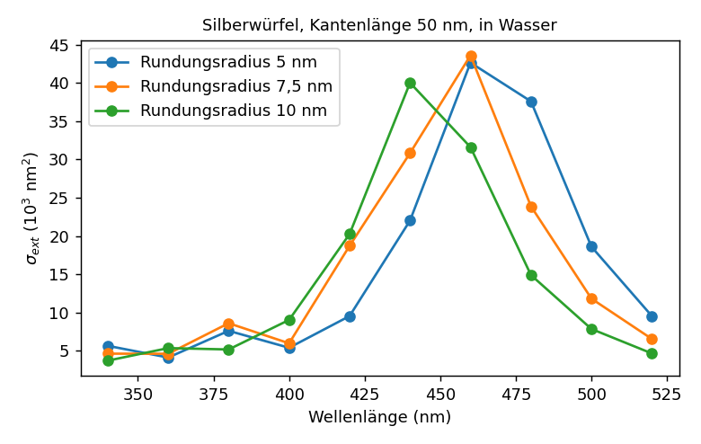

# Ergebnisse: Würfel mit abgerundeten Kanten im Resonanzfenster

Würfel [−1, 1]³, alle Kanten (und damit Ecken) mit Radius ρ gerundet (Gmsh/OpenCASCADE, `fillet`), ωa = 0,5,
ebene Welle, `scatter_mesh` mit Sauter-Schwab/halbanalytischem Nahfeld, H-Matrix-Toleranz 10⁻³, GMRES 10⁻⁵.

Netz (`tools/make_geometries.py roundcube h out.msh --radius ρ --curv c`): auf den Rundungen Elementgröße
2πρ/c, auf den flachen Seiten mit dem Abstand zur Rundung linear bis h wachsend (Gmsh-Felder Distance/Threshold,
Übergang über max(h, 3ρ)). Verfeinerungsfolge (h, c) = (0,4; 8), (0,3; 12), (0,22; 16). Ohne diese Abstufung
(flache Seiten gleich grob neben der Rundung) konvergiert die Folge für kleines ρ nicht erkennbar (ρ = 0,1:
16,03 → 16,44 → 16,91), weil das an der Rundung konzentrierte Feld auf den angrenzenden flachen Stücken nicht
aufgelöst ist.

## Konvergenz bei festem Radius

| | c = 8 | c = 12 | c = 16 | Differenzen |
|---|---:|---:|---:|---:|
| ρ = 0,2, κ = −2,8 + 0,3i | 14,2237 (1 504) | 13,3077 (3 294) | 12,8649 (5 282) | −0,92 / −0,44 |
| ρ = 0,3, κ = −2,8 + 0,3i | 19,6033 (888) | 18,3948 (1 930) | 17,8708 (3 282) | −1,21 / −0,52 |
| ρ = 0,4, κ = −2,8 + 0,3i | 25,1225 (552) | 24,7659 (1 208) | 24,3995 (2 048) | −0,36 / −0,37 |
| ρ = 0,3, Gold −11 + 1,2i | 10,2095 | 10,3878 | 10,4130 | +0,18 / +0,025 |

(σ_ext, in Klammern Dreieckszahl.) Mit abgerundeten Kanten verhält sich das Fenster wie ein gewöhnliches Problem:
Die Folgen sind monoton, die Differenzen halbieren sich (ρ = 0,2 und 0,3; beobachtete Ordnung etwa 1 in der
Elementgröße an der Rundung). Zum Vergleich der scharfe Würfel bei κ = −3 + 0,3i (v0.5): 18,24 → 18,69 → 18,59 →
18,33, nicht monoton. Außerhalb des Fensters (Gold) konvergiert es deutlich schneller. Bei ρ = 0,4 ist der
asymptotische Bereich mit dieser Folge noch nicht erreicht.

## Abhängigkeit vom Radius

Die Extinktion hängt im Fenster stark vom Rundungsradius ab: 24,4 (ρ = 0,4), 17,9 (0,3), 12,9 (0,2) auf dem jeweils
feinsten Netz; grob extrapoliert (Ordnung 1) etwa 23, 16 und 11,5. Eine Halbierung des Radius von 0,4 auf 0,2
halbiert die Extinktion ungefähr. Der Rundungsradius ist damit im Fenster ein entscheidender physikalischer
Parameter; einen Grenzwert für ρ → 0 gibt es bei kleinem Verlust nicht zu erwarten.

## Bewertung

- Die Abrundung macht das Resonanzfenster rechenbar: Die Lösung konvergiert mit dem Netz, was an scharfen Kanten
  nicht gelang. Der Preis ist die Auflösung des Radius; die Kosten wachsen etwa mit 1/ρ (ρ = 0,2: 5 282 Dreiecke,
  110 s; ρ = 0,1 mit Abstufung wäre ein Vielfaches).
- Die Konvergenz ist mit Ordnung etwa 1 langsamer als bei glatten, gut aufgelösten Körpern (Kugel: Ordnung 2);
  die Rundungen sind mit 2 bis 4 Elementen über den Viertelbogen noch grob. Feinere Folgen brauchen mehr Rechenzeit
  als hier verfügbar.
- Für AP 4 bedeutet das: Vorhersagen für Nanowürfel im Fenster sind nur zusammen mit dem Rundungsradius sinnvoll,
  der aus Elektronenmikroskopie bekannt sein muss. Das ist physikalisch realistisch und experimentell überprüfbar.

## Spektrum eines Silberwürfels in Abhängigkeit vom Rundungsradius

Silberwürfel, Kantenlänge 50 nm (Längeneinheit 25 nm), in Wasser (n = 1,33), Johnson-Christy-Daten, Netze mit
c = 12 (1 208 / 1 930 / 3 294 Dreiecke für ρ = 10 / 7,5 / 5 nm), `spectrum` mit H-Toleranz 10⁻³.

| λ (nm) | 340 | 360 | 380 | 400 | 420 | 440 | 460 | 480 | 500 | 520 |
|---|---:|---:|---:|---:|---:|---:|---:|---:|---:|---:|
| ρ = 10 nm | 3 704 | 5 343 | 5 165 | 9 028 | 20 254 | **40 030** | 31 609 | 14 889 | 7 843 | 4 646 |
| ρ = 7,5 nm | 4 617 | 4 601 | 8 598 | 5 970 | 18 715 | 30 834 | **43 610** | 23 880 | 11 808 | 6 539 |
| ρ = 5 nm | 5 643 | 4 109 | 7 602 | 5 387 | 9 532 | 22 020 | **42 656** | 37 599 | 18 599 | 9 529 |

(σ_ext in nm².) Die Hauptresonanz verschiebt sich mit schärferen Kanten nach Rot (Maximum grob bei 440, 460 und
knapp 470 nm) und verbreitert sich zur langen Wellenlänge hin; zusätzlich gibt es eine schwächere Struktur bei
360 bis 380 nm, deren Lage ebenfalls vom Radius abhängt. Die zugehörigen Kontraste κ = ε_Ag/ε_Wasser sind
−1,91 + 0,11i (380 nm, im Resonanzfenster [−3, −1/3] der Kante) und −3,7 bis −4,9 (440 bis 480 nm, außerhalb des
Fensters, aber innerhalb der L²-kritischen Schleifen der Kante). Für scharfe Kanten wären beide Bereiche mit dem
L²-Verfahren nicht zuverlässig rechenbar.

Netzkontrolle bei ρ = 7,5 nm (c = 8 / 12 / 16): 31 523 / 30 834 / 30 538 nm² bei 440 nm, 40 177 / 43 610 / 44 748 nm² bei
460 nm. Mit c = 12 liegt der Fehler nahe der Resonanz also bei einigen Prozent; die Maxima verschieben sich mit
feinerem Netz leicht nach Rot. Die Wellenlängenschritte von 20 nm sind grob. Die Spektren sind qualitativ
belastbar (Richtung und Größenordnung der Verschiebung), für quantitative Vergleiche mit Messungen sind feinere
Netze und Wellenlängenschritte nötig.
