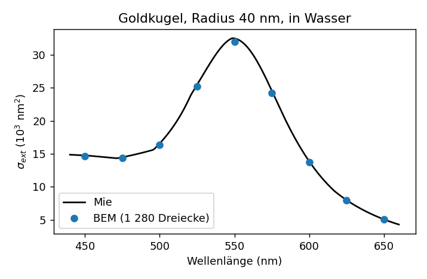
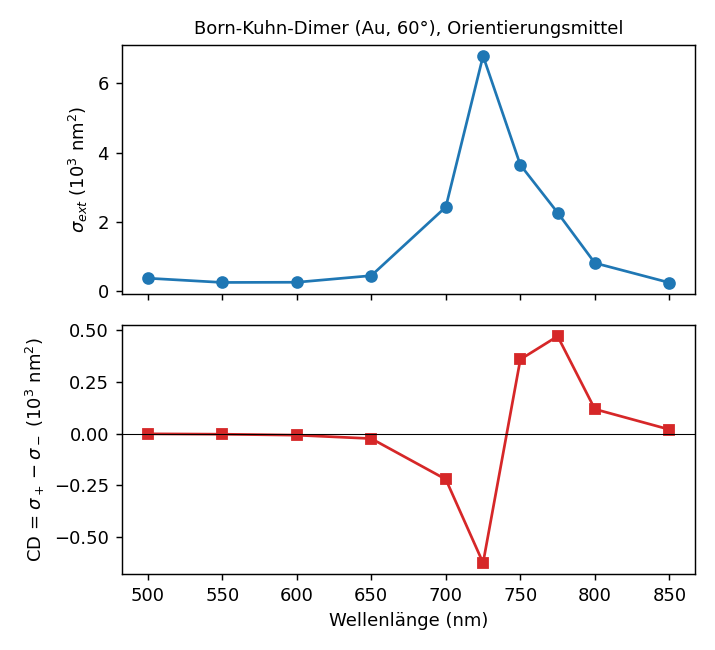

# Ergebnisse: Spektren mit dispersiven Materialien und Orientierungsmittelung (C++-Kern v0.8)

## Umsetzung

- **Materialien** (`core/materials.hpp`): konstante Permittivität oder tabellierte optische Konstanten
  n, k über der Vakuumwellenlänge, lineare Interpolation in n und k, ε = (n + ik)². Mitgeliefert:
  Johnson-Christy-Daten für Au und Ag aus der refractiveindex.info-Datenbank (CC0, `data/materials`).
- **Einheiten:** Die Geometrie ist in einer Längeneinheit L₀ (nm) gegeben; ω = 2π L₀/λ ist die
  Vakuumwellenzahl in 1/L₀, das Hintergrundmedium hat ε = n_bg². Querschnitte in nm².
- **Orientierungsmittelung** (`sources/orientation.hpp`): Mittelung über Einfallsrichtungen mit
  Lebedev-Regeln (6, 14, 26 Punkte, exakt bis Grad 3, 5, 7), zirkulare Polarisation jeweils relativ zur
  Einfallsrichtung; entspricht der Mittelung über Körperorientierungen. Die Operatoren werden je
  Wellenlänge einmal aufgebaut, pro Richtung und Polarisation wird nur gelöst.
- **App** `spectrum`: Kugel oder Gmsh-Netz, Materialien je Körper, Hintergrund, Wellenlängenliste,
  lineare oder zirkulare Polarisation, `--orient 1|6|14|26`, `--verbose` für richtungsaufgelöste Werte.

## Goldkugel in Wasser (Radius 40 nm, 1 280 Dreiecke)

| λ (nm) | 450 | 500 | 525 | 550 | 575 | 600 | 625 | 650 |
|---|---:|---:|---:|---:|---:|---:|---:|---:|
| BEM (nm²) | 14 624 | 16 401 | 25 181 | 32 009 | 24 221 | 13 759 | 7 998 | 5 118 |
| Mie (nm²) | 14 770 | 16 569 | 25 458 | 32 490 | 24 576 | 13 869 | 7 999 | 5 078 |
| Abw. | 1,0 % | 1,0 % | 1,1 % | 1,5 % | 1,4 % | 0,8 % | 0,01 % | 0,8 % |

Die Abweichungen entsprechen der Auflösung (1 280 Dreiecke; vgl. die Konvergenz zweiter Ordnung in
`results_scattering.md`). Kontrolle der Orientierungsmittelung: Für die Kugel liefern 1 und 6 Richtungen
denselben Wert (31 639 nm² bei 550 nm, 720 Dreiecke).

## Born-Kuhn-Dimer, orientierungsgemittelt

Zwei Goldstäbe (Länge 60 nm, Radius 6 nm, Abstand 24 nm entlang der Stapelachse, um 60° gegeneinander
gedreht; 1 148 Dreiecke), Vakuum, Lebedev-6-Mittelung.

| λ (nm) | 600 | 650 | 700 | 725 | 750 | 775 | 800 | 850 |
|---|---:|---:|---:|---:|---:|---:|---:|---:|
| σ_ext (nm²) | 263 | 453 | 2 435 | 6 795 | 3 650 | 2 271 | 817 | 251 |
| CD (nm²) | −8 | −24 | −221 | −623 | +357 | +469 | +117 | +19 |

Der CD ist bisignat um die Plasmonresonanz (Nulldurchgang zwischen 725 und 750 nm), wie für gekoppelte
Dipole (Born-Kuhn-Modell) erwartet.

Kontrollen:
- **Enantiomer** (−60°) bei 725 nm: CD = +623,16 nm² gegenüber −623,17 nm² (relativ 10⁻⁵).
- **Achirale Anordnung** (parallele Stäbe, φ = 0°, 14 Richtungen, 1 150 Dreiecke) bei 700 nm: richtungsaufgelöst
  |CD| ≤ 0,5 nm² bei σ ≈ 8 000 nm² (6·10⁻⁵), gemittelt −0,06 nm².

## Aufwand

Je Wellenlänge Aufbau der drei Operatoren (außen, zwei Stäbe) und 2 × 6 Lösungen mit 60–70 GMRES-Iterationen
(punktweise Vorkonditionierung): 50 s bei 1 148 Dreiecken auf einem Kern. Die Iterationszahl ist bei diesen
plasmonischen Stäben der größte Kostenfaktor; die Blockvorkonditionierung für mehrere Körper wäre der
naheliegende nächste Schritt. Mehrere rechte Seiten (Richtungen, Polarisationen) werden derzeit nacheinander gelöst.
